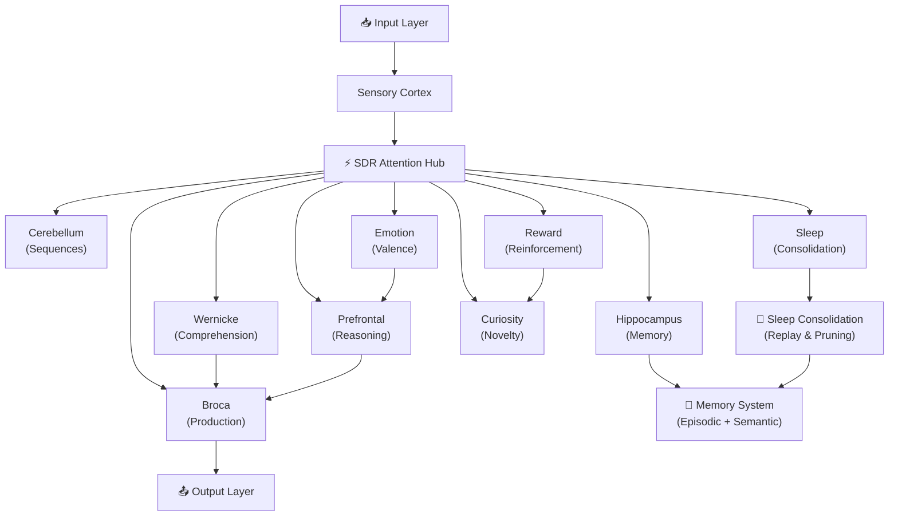

# Ilaria

[](https://github.com/office233/ilaria/actions/workflows/ci.yml)

A Romanian-first small language model with its own Go inference engine and a hippocampus-inspired memory that learns new facts in one shot.

Ilaria is an independent research project: a bilingual (Romanian–English) language cortex trained from scratch
(see [Ilaria-130M](#ilaria-130m--the-forge-trained-language-cortex-2026-09-22)), served by an engine written in Go,
and wrapped in a cognitive architecture — Sparse Distributed Representations, associative memory, online learning,
sparse routing and local-first compute.

**Ilaria is built to power [Swypik](https://swypik.com)** — a video-native social-commerce platform for Romania and
Central-Eastern Europe, and its companion Romanian ERP. There Ilaria's job is content moderation, a Romanian
shopping assistant, captions and translation, and product-quality scoring, and its one-shot memory lets it learn a
new product, price or policy the moment it appears, without retraining.

(Formerly *NexusCortex*; Go module and command names still carry the old prefix.)

This is not a replacement for frontier LLMs. It is not an AGI claim. The goal is to understand and implement low-level AI system primitives from scratch.

<p align="center">
  
  
  
  
</p>

<p align="center">
  <a href="#what-it-implements">What It Implements</a> •
  <a href="#architecture">Architecture</a> •
  <a href="#quick-start">Quick Start</a> •
  <a href="#neural-dashboard">Dashboard</a> •
  <a href="#benchmark-performance-local-vs-own-dense-baseline">Benchmarks</a> •
  <a href="#roadmap">Roadmap</a>
</p>

---

## What It Implements

- **SDR-based attention** — popcount similarity and top-K retrieval (`sdr_attention.go`)
- **Sparse ternary compute** — RGBA32 packed weights, 0.25 bytes/param (`neurotexture.go`, `ternary.go`)
- **10 neural region modules** — Wernicke, Broca, Hippocampus, Prefrontal, Cerebellum, Emotion, Curiosity, Sleep, Sensory, Reward
- **Episodic and semantic memory** — storage and retrieval prototypes (`hippocampus.go`)
- **Online learning** — continuous learning without full retraining
- **Sleep consolidation** — replay-inspired episodic → semantic memory transfer (`sleep_consolidation.go`)
- **Fractal architecture** — multi-block expert routing (`fractal_cortex.go`)
- **Thousand Brains Theory** — Jeff Hawkins-inspired implementation (`thousand_brains.go`)
- **Local dashboard** — web UI for inspecting runtime state, emotional compass, cognitive vitals
- **CUDA compute backend** — optional GPU acceleration for sparse forward passes
- **Go tests** — 137 tests + 3 fuzz smoke tests, `go vet`, `staticcheck`, `gosec`, `govulncheck`

---

## Why I Built It

I wanted to learn what sits below API-level AI development: memory, retrieval, sparse representations, inference loops, state, routing, and performance constraints.

Instead of only calling model APIs, I built experimental components from scratch to understand how these mechanisms behave.

---

## System Overview



---

## Architecture

### Neural Regions

| Module | Inspired By | What It Does |
|--------|-------------|--------------|
| **Wernicke** | Wernicke's area | Language comprehension — encodes input into sparse representations |
| **Broca** | Broca's area | Language production — generates output from neural activity |
| **Hippocampus** | Hippocampus | Episodic & semantic memory formation, storage, retrieval |
| **Prefrontal** | Prefrontal cortex | Reasoning, decision-making, reservoir computing |
| **Cerebellum** | Cerebellum | Motor planning and sequence coordination |
| **Emotion** | Limbic system | Valence-arousal emotional state modulation |
| **Curiosity** | Dopaminergic system | Novelty detection, exploration drive |
| **Sleep** | Sleep cycles | Memory consolidation, synaptic pruning, replay |
| **Sensory** | Sensory cortex | Input encoding and signal processing |
| **Reward** | Reward circuits | Reinforcement learning signals |

### Project Structure

```
ilaria/
├── cmd/
│   ├── cortex/              # Interactive CLI
│   ├── cortex-train/        # Curriculum trainer
│   ├── cortex-eval/         # Evaluation runner
│   ├── cortex-autonomous/   # Autonomous learning loop
│   ├── cortex-web/          # Dashboard server
│   ├── cortex-tokenizer/    # Tokenizer tools
│   ├── cortex-diagnose/     # System diagnostics
│   ├── corpus-convert/      # Corpus format converter
│   └── train/               # Alternative trainer
├── cortex/                  # Core engine (all regions, compute, tests)
├── cuda/                    # CUDA kernel implementations
├── web/                     # Dashboard UI
├── data/
│   ├── corpus/              # Training corpora
│   └── evals/               # Evaluation suites
├── docs/                    # Research docs & benchmarks
└── .github/workflows/       # CI/CD pipeline
```

---

## Continual Learning Benchmark — "learn once, answer forever"

The one capability this architecture has that a frozen LLM structurally cannot:
**learning a new fact from a single exposure, with zero gradient updates, that
survives a full restart.**

Protocol (`cmd/continual-bench`, 100 invented facts in `data/evals/continual.jsonl`
that appear in no training corpus anywhere): each fact is stored ONCE in the
hippocampus, persisted to disk, the process state is discarded, and a fresh
process answers paraphrased questions using the same frozen transformer
(DistilGPT-2 82M imported via `cmd/gpt2-import`) three ways:

| Arm | Strict accuracy | Token recall |
|-----|----------------|--------------|
| **Full system** (episodic memory → context + logit bias) | **96%** | 65% |
| Logit bias only (no context injection) | 2% | 2% |
| **Frozen LLM baseline** (same weights, no memory) | **1%** | 1% |

- Memory recall after restart: **100%** · gradient updates: **0** · weight hash
  verified identical before/after.
- Scoring: word-boundary matching, scorer v2 (`cortex/evalsuite`).
- Honest reading: the win comes from one-shot episodic retrieval feeding the
  frozen generator's context (plus a bounded logit bias). The bias alone does
  not carry multi-token invented words — that ablation is reported, not hidden.
- Reproduce: `go run -tags gpu ./cmd/continual-bench -gpu -rep-penalty 1.0 -temp 0.3`
  (CPU works too, drop the flags).

---

## Biomedical organ with real sources (`cortex/biomed`)

Ilaria's first *knowledge organ*: it answers drug questions **only** from live public
sources and shows its evidence. There is no hand-written drug table; what a source
does not know is listed under "Could not determine".

| Source | What it provides |
|---|---|
| RxNorm (NLM) | drug-name normalization (any spelling → RxCUI), full name index for detecting mentions in free text |
| ChEMBL (EMBL-EBI) | molecule properties, curated mechanism of action + protein target, measured IC50/Ki |
| openFDA | the official FDA label: boxed warning, contraindications, interactions, dosing, special populations, pharmacokinetics |
| Open Targets | disease normalization, target↔disease association scores, clinical-stage drugs |
| PubMed | literature counts and PMIDs for (drug, variant) pairs |

Responses are cached under `data/knowledge/biomed/` (this *is* the knowledge on disk;
it grows with every entity met and can live on Google Drive) and every consult extends
an evidence-carrying knowledge graph (`graph.json`). Pharmacokinetic parameters are
extracted from the label text with their quoted sentence and feed a one-compartment
model; if the label states no half-life, the simulation is refused instead of guessed.

```bash
go run ./cmd/nexus-biomed -query "gefitinib și warfarină la pacient cu EGFR T790M" -patient patient.json -dose 250
```

`patient.json` is either a FHIR Bundle or `{"active_medications":["warfarin"],"variants":[{"gene":"EGFR","change":"T790M"}],"labs":{"eGFR":{"value":38,"unit":"mL/min/1.73m2"}}}`.
Inside the organism the same organ is a `Tool` (enable with `"biomed_enabled": true`
in the config); it speaks only when the RxNorm index finds a drug in the input and stays
silent offline. `cortex/swe` now holds a **real** sandbox (`RunGo`) that vets, builds and
tests Go code through the actual toolchain, the organism's self-verification organ.

## Ilaria-130M — the forge-trained language cortex (2026-09-22)

The first real language cortex was trained from scratch in the forge (`forge/train_ilaria.py`)
on a Colab GPU runtime and runs unchanged in the Go engine:

| | |
|---|---|
| architecture | 12 layers, d 768, 12 heads, SwiGLU 2688, RoPE, ctx 1024, tied head — 128.1 M params |
| tokenizer | byte-level BPE 32k trained on a balanced RO/EN sample (`forge/hf_tokenizer.py`), id-identical to the Go byte-level mode |
| corpus | 5.8 M documents → 3.72 G tokens: FineWeb-2 RO, FineWeb-Edu, Wikipedia RO/EN (`forge/prepare_corpus.py`, `forge/concat_streams.py`) |
| training | 11 500 steps × 262 k tokens = 3.0 G tokens, bf16 + `torch.compile`, ~210 k tok/s, ≈ 4 h |
| validation | loss 2.894, perplexity **18.1** (best at step 10 000; `data/forge/brain-a/training.log`) |
| held-out (Wikipedia articles created in 2025, `forge/eval/`) | perplexity **24.4** overall — RO 20.8, EN 28.7 (`forge/ppl.py`, float32) |
| Go ≡ PyTorch on the real weights | max \|Δ logit\| 2·10⁻⁵, argmax identical on every position, identical token ids (`TestForgeBrainEquivalence`) |
| continual-learning benchmark with this cortex | strict accuracy **89 %** (bias-only 1 %, frozen 1 %), memory recall 100 %, zero gradient updates |

What it is not: an instruction-following model. Asked a question through the organism it continues text
like the web it was trained on; phase 2 (distillation / SFT with the organs in the loop) is what turns the
cortex into an assistant. Every answer of `cmd/cortex` now carries a provenance line
(`[provenance] source=tool|memory|reasoning|broca|none tool=<name>`), so it is visible which module answered.

```bash
# generation on the GPU (needs CGO + -tags gpu, see above)
go run -tags gpu ./cmd/nxtf-run -data-dir data/forge/brain-a -gpu -prompt "Ștefan cel Mare a fost" -max-tokens 60 -rep-penalty 1.2
# Go ≡ PyTorch on the real weights
python forge/dump_logits.py --brain data/forge/brain-a --out data/forge/brain-a/logits_ref.json
NEXUS_BRAIN_DIR=$PWD/data/forge/brain-a go test ./cortex -run TestForgeBrainEquivalence -count=1 -v
# perplexity on any UTF-8 text, both engines
python forge/ppl.py --brain data/forge/brain-a --text forge/eval/heldout_wiki_2025.txt
go run ./cmd/nxtf-ppl -data-dir data/forge/brain-a -text forge/eval/heldout_wiki_2025.txt
```

The Colab path (notebook, Drive layout, runner scripts) is documented in `forge/COLAB_GUIDE.md` and `forge/colab/`.

## Ternary English cortex — BitNet b1.58 2B4T inside the Go engine (2026-09-24)

The study in `docs/research/2026-09-24-ilaria-1.58-multimodal-studiu.md` concluded that a natively-trained
1.58-bit model beats any 16→1.58-bit conversion at equal size, so Ilaria's English cortex is Microsoft's
open BitNet b1.58 2B4T (MIT, 4 T tokens), imported into the engine's own ternary format and run with the
same integer arithmetic bitnet.cpp uses (ternary weights × int8 per-token activations, int32 accumulation):

- `forge/import_bitnet.py` → NXTF v3 (`NXTF3BIN`, ternary tiles packed exactly like `PackTernaryTile`), 1.83 GB
  because the tied 128k×2560 embedding is kept in float32; loads in ~3 s (`cortex/bitnet_persist.go`).
- `cortex/bitnet*.go`: BitLinear, RMSNorm/subln, GQA 20/5, ReLU² GLU, half-rotate RoPE, KV-cache decoder,
  greedy and top-k/top-p sampling; `cortex/tokenizer_llama3.go`: Llama-3 byte-level BPE with a hand-written
  cl100k pre-tokenizer (309/309 test lines identical to HF `tokenizers`) and the BitNet chat template.
- Verification: a tiny BitNet built with HF code matches to 5·10⁻⁷; the real 2.4B checkpoint is compared
  statistically (`TestBitNetEquivalence`, `NEXUS_BITNET_DIR`), because int8 activation quantization in 210
  layers makes per-logit tolerances meaningless — PyTorch itself differs by 0.37 between 1 and 4 BLAS threads:
  KL(PyTorch ‖ Go) 0.0002–0.016 nats, argmax agreement 45/46, greedy prefixes identical.
- Speed: `cmd/bitnet-run -cuda` runs the whole decode step on the GPU with kernels compiled at run time by
  NVRTC (no nvcc): ternary weights stay packed (0.6 GB), KV cache resident, fp16 tied head — **37–40 tok/s on
  a GTX 1660 Ti** (2.9 GB), argmax identical to the CPU path on the real model. Pure-Go CPU decode is
  ~0.5–1 tok/s on 8 threads (bitnet.cpp reaches 80–110 with LUT kernels). The vision tower also runs on the
  GPU through cuBLAS (`ilaria-see -gpu`, 61 s → 8 s).

### Eyes (2026-09-24): SigLIP2 → pixel-shuffle → projector → ternary cortex

Stage 1 of `forge/multimodal/` (projector only, SigLIP2-base and BitNet frozen, Cauldron caption subsets,
2 000 steps × 128 images ≈ 1.7 h on one Colab GPU, ~25 compute units) turned the ternary cortex into a
captioner: loss 4.2 → 1.0, captions such as "a person surfing on the water" and "Screen displaying the option
to upload user information in social app". The exported adapter (`export_adapter.py`, 24.25 M params) runs in
the Go engine (`cortex/vision_siglip*.go`, `cmd/ilaria-see`; tower Go≡PyTorch max |Δ| 1.3·10⁻³, projector
6.7·10⁻⁵): a Wikimedia cat photo → "In this picture we can see a cat and it is in black and brown color.",
a pug in a blanket → "A dog with a blanket on it on a path." — on the CPU, tower ≈ 1 min, prefill ≈ 2–3 min.
`ilaria-see -gpu -cuda` splices the same header/image/tail embedding rows straight into the NVRTC decoder's
resident residual buffer (`BitNetCUDADecoder.PrefillEmbeds`, `cortex/bitnet_cuda.go`) instead of the CPU
prefill, cutting that 2–3 min down to **~3.6–3.8 s for 134 rows** and decoding at **~39 tok/s** — same
captions as the CPU path, both GPU backends resident together in 3.4 GB of the 6 GB GTX 1660 Ti.

```bash
go run ./cmd/ilaria-see -model data/forge/bitnet-2b4t/bitnet.nxtf -tokenizer data/pretrained/bitnet-b1.58-2B-4T/tokenizer.json \
   -tower data/forge/eyes/siglip2_base.nxtf -adapter data/forge/eyes/adapter_export -image photo.jpg
```

```bash
python forge/import_bitnet.py --hf-dir data/pretrained/bitnet-b1.58-2B-4T --out data/forge/bitnet-2b4t/bitnet.nxtf
go run ./cmd/bitnet-run -model data/forge/bitnet-2b4t/bitnet.nxtf -tokenizer data/pretrained/bitnet-b1.58-2B-4T/tokenizer.json \
   -chat -prompt "Explain in two sentences why the sky is blue." -max-tokens 60 -greedy
# → "The sky appears blue because of a phenomenon called Rayleigh scattering, …"
```

### Ears (in progress): Whisper-small encoder → stack-and-project → ternary cortex

Stage 1 groundwork for the "ears" modality (no trained projector yet): a from-scratch Go port of the
`openai/whisper-small` ENCODER plus its log-mel front end — reflect-padded STFT framing, a periodic Hann
window, a direct real DFT (n_fft=400 isn't a power of 2), the exported mel filterbank as a plain matmul (no
librosa/slaney formula in Go at all), two strided Conv1d+GELU layers, fixed sinusoidal positions, and 12
pre-LN transformer layers — plus `StackFrames` (Ultravox-style temporal token reduction, k=8) and the
projector module shape (`cortex/audio_whisper*.go`, `cmd/ilaria-hear`). Checked against the real checkpoint
on a synthetic 3 s test tone (`forge/multimodal/export_whisper_tower.py`, `dump_audio_reference.py`):
log-mel max|Δ| 1.2·10⁻³ over the front 64 values; conv-stack/hidden-layer/final-output max|Δ| 0.01–0.08 with
relative L2 error 1.4·10⁻⁴–1.4·10⁻³ throughout (the growing max|Δ| in the last few layers tracks Whisper's
own "massive activation" outlier channels — a handful of dimensions with much larger magnitude than the
rest of the 768-wide vector — not a systematic drift: relL2 stays flat); the random-weight projector
(round-tripped through `export_audio_adapter.py`, same format the vision projector uses) matches to
3.0·10⁻³. A 3 s clip (150 real frames of Whisper's fixed 1 500-frame/30 s window) takes ~80–90 s to encode
on the CPU. `cmd/ilaria-hear` runs the same tower + `StackFrames` + (if `-adapter` is given) projector +
`-cuda` NVRTC-decoder splice as `ilaria-see` does for images, but since `train_stage1_audio.py` hasn't
produced a trained checkpoint yet, only the plumbing is validated end-to-end — decoded text with the random
projector is not a real transcript.

## Benchmark Performance (local, vs own dense baseline)

| Operation | Speed | Allocations |
|-----------|-------|-------------|
| RadioNeuron Pack | **0.24 ns/op** | 0 allocs |
| RadioBus Emit (256 channels) | **1.65 ns/op** | 0 allocs |
| RadioCortex 100K neurons/tick | **1.18 ms** | 0 allocs |
| RadioCortex 1M neurons/tick | **11.8 ms** | 0 allocs |
| ForwardSparse vs Dense | **26.3× faster** | — |
| ForwardQuantum vs Dense | **73.9× faster** | — |
| NeuroRadioCortex 100K tiles/tick | **15.2 ms** | 0 allocs |

---

## Research Foundations

| Theory | Implementation |
|--------|---------------|
| **Sparse Distributed Representations** (Numenta) | `sdr.go`, `sdr_fast.go`, `sdr_pool.go` |
| **Thousand Brains Theory** (Jeff Hawkins) | `thousand_brains.go` |
| **BitNet b1.58** (ternary weights) | `ternary.go`, `neurotexture.go` |
| **Mixture of Experts** (Switch Transformer) | `fractal_cortex.go`, `expert_shard.go` |
| **Global Workspace Theory** (Baars) | `workspace.go` |
| **Predictive Coding** | `predictor.go`, `confidence.go` |
| **Hebbian/STDP Learning** | `error_learning.go`, `reward.go` |
| **Memory Consolidation** (sleep replay) | `sleep_consolidation.go` |
| **Hyperdimensional Computing** | `sdr_attention.go` |

---

## Test Results

```
ok   nexus-cortex/cmd/cortex       1.3s    ✅
ok   nexus-cortex/cmd/cortex-web   9.5s    ✅
ok   nexus-cortex/cortex          86.3s    ✅  (137 tests + 3 fuzz tests)
```

---

## Current Limitations

- **Language generation is not comparable to modern LLMs.** This is a sparse-compute prototype, not a language model.
- **Benchmarks are local** and should be treated as directional until independently reproduced.
- **Some modules are experimental** and need stronger evaluation and ablation testing.
- **Several architecture ideas are exploratory, not proven** — the neuroscience-inspired design is speculative.
- **This project is useful as an AI systems learning/research prototype**, not as a production model.

---

## Best Code Entry Points

If you want to explore the codebase, start here:

| File | What It Shows |
|------|---------------|
| `cortex/sdr_attention.go` | SDR attention and scratch-buffer optimization |
| `cortex/hippocampus.go` | Memory storage and retrieval experiments |
| `cortex/fractal_cortex.go` | Sparse/expert routing experiments |
| `cortex/sleep_consolidation.go` | Memory consolidation via replay |
| `.github/workflows/ci.yml` | Validation pipeline (test, vet, fuzz, security) |

---

## Tech Stack

| Layer | What |
|-------|------|
| **Language** | Go 1.21+ |
| **Compute** | CPU-first, optional CUDA kernels |
| **Weight format** | RGBA32 ternary tiles (0.25 bytes/param) |
| **Storage** | JSON persistence + NTX1 binary format |
| **Dashboard** | Vanilla HTML/CSS/JS |
| **CI** | GitHub Actions (`go test -race`, `go vet`, `govulncheck`, `staticcheck`, `gosec`) |
| **Dependencies** | 4 Go modules: `govaluate`, `mmap-go`, `go-webgpu`, `golang.org/x/sys` |

---

## Neural Dashboard

A local web UI for inspecting cognitive state, emotional compass, memory stats, and interacting with the system in real time.

```bash
go run ./cmd/cortex-web -port 8080 -data-dir ./data/cortex -open
```

---

## Quick Start

### Prerequisites
- Go 1.21+ (tested on 1.26)
- No other dependencies required

### Build & Run

```bash
# Clone
git clone https://github.com/office233/ilaria.git
cd ilaria

# Build
go build ./...

# Train on demo corpus
go run ./cmd/cortex-train \
  -data-dir ./data/cortex \
  -corpus ./data/corpus/general.jsonl \
  -epochs 15 \
  -curriculum=true \
  -revisit=true

# Run evaluation
go run ./cmd/cortex-eval -data-dir ./data/cortex

# Start dashboard
go run ./cmd/cortex-web -port 8080 -data-dir ./data/cortex -open
```

---

## Roadmap

- [x] 10 neural regions with sparse compute
- [x] Curriculum training with surprise-based replay
- [x] Sleep consolidation
- [x] Neural Dashboard
- [x] Autonomous learning loop
- [x] CUDA compute backend
- [x] 137 unit tests + 3 fuzz tests
- [x] CI/CD pipeline
- [ ] NTX binary checkpoint format (mmap-friendly)
- [ ] Expert Atlas with disk-backed experts
- [ ] Top-K expert routing
- [ ] Improved language generator (Broca 2.0)
- [ ] BPE tokenizer (32K vocab)
- [ ] Benchmark arena (1000+ test cases)
- [ ] WebGPU compute backend

---

## FAQ

**Why Go?**
Speed, simplicity, easy concurrency, single binary output, no dependency hell. Go compiles the entire project in 5 seconds.

**Do I need a GPU?**
No. CPU-first design. CUDA is optional and only accelerates sparse ternary forward passes.

**How many parameters?**
~500M with a single cortex block. Scales with FractalCortex blocks.

---

## License

GNU Affero General Public License v3.0 (AGPL-3.0) - see the [LICENSE](LICENSE) file for details.

---

<p align="center">
  ⭐ Star this repo if you're interested in low-level AI systems and sparse compute.
</p>
