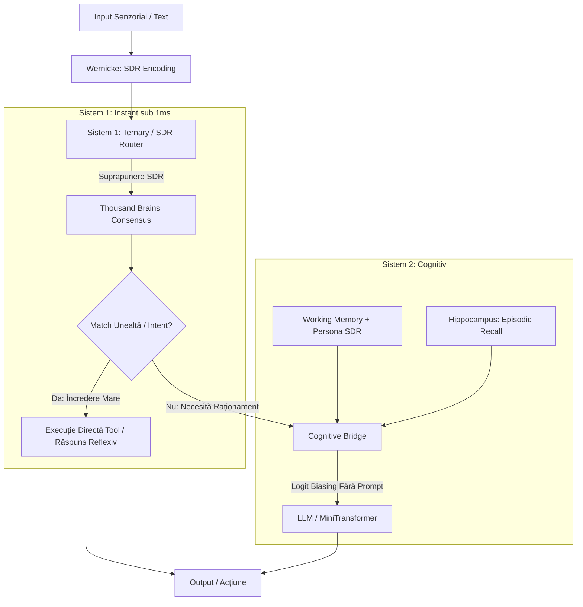

# Ilaria: Arhitectura „Prompt-less Cognition” & Modulul Decizional Sistem 1 (Jev-Inspired)

**Data:** 27 Septembrie 2026  
**Status:** Design & Specificație Tehnică  
**Autor:** Echipa Ilaria / Ilaria  
**Document Corelat:** [2026-09-24-ilaria-1.58-multimodal-studiu.md](file:///d:/ilaria/docs/research/2026-09-24-ilaria-1.58-multimodal-studiu.md), [cognitive_bridge.go](file:///d:/ilaria/cortex/cognitive_bridge.go)

---

## 1. Rezumat Executiv & Teză

Generația actuală de sisteme bazate pe LLM depinde în totalitate de **prompting** (system prompts masive, few-shot examples, scheme de unelte JSON în context). Această abordare este o consecință a faptului că LLM-urile clasice sunt **stateless** (amnezice la fiecare rulare).

În biologie și în arhitectura neuronală **Ilaria (Ilaria)**, nu există „prompt”. Creierul uman comunică între regiuni (Wernicke, Broca, Hippocampus) prin **stare continuă, reprezentări distribuite rare (SDR - Sparse Distributed Representations) și atractori sinaptici**.

Inspirat de apariția recentă a modelelor decizionale de tip **„Sistem 1” (cum este Jev AI dezvoltat de TypeSafe AI)** și de cercetările de top discutate în comunitate, acest document definește trecerea Ilariei către o **arhitectură cognitivă autonomă fără prompturi (Prompt-less Cognition)**.

---

## 2. De ce Prompting-ul este o Anomalie

| Paradigma Tradițională (LLM / Prompt-driven) | Paradigma Ilaria (Biologică / State-driven) |
| :--- | :--- |
| **Stateless:** Modelul uită totul între request-uri. | **Persistent State:** Memoria episodică (Hippocampus) și `WorkingMemory` își păstrează starea. |
| **System Prompt text:** 1.000–3.000 tokeni injectați forțat pentru a simula o personalitate. | **Persona SDR / Homeostatic Drive:** Vector persistent de stare care modulează direct potențialele și logits-urile. |
| **Tool Calling via JSON Schemas:** Mii de tokeni consumați doar pentru a descrie uneltele în limbaj natural. | **SDR Codebook Dispatch:** Fiecare unealtă are o amprentă binară SDR. Declanșarea se face prin suprapunere asociativă. |
| **Few-Shot Examples:** Exemple hardcodate în prompt pentru ghidare. | **One-Shot Episodic Resonance:** Hippocampus-ul rezonează cu stimulul și înclină logits-urile prin `CognitiveBridge`. |
| **Latență & Cost:** 300–1200 ms și $0.005–$0.02 per interogare doar pentru rutare. | **Sub-milisecundă & Cost Zero:** Clasificare prin straturi ternare BitNet/SDR pe CPU/CUDA local. |

---

## 3. Cei 4 Piloni ai Arhitecturii „Prompt-less” în Ilaria



### Pilonul 1: Jev-Style System 1 (Clasificator Decizional Tipat)
* **Concept:** Un strat decizional ultra-rapid (derivat din ponderile ternare BitNet ale Ilariei sau un model decizional structurat).
* **Mecanism:**
  1. Wernicke generează `InputSDR` (vector de 2048 de biți).
  2. Sistemul 1 aplică proiecții rapide și returnează un **struct Go tipat**, nu text:
  ```go
  type System1Decision struct {
      IntentKind   IntentType  // e.g. IntentQuery, IntentToolAction, IntentMemoryStore
      TargetToolID uint16      // ID direct de unealtă (0 dacă nu este cazul)
      Confidence   uint8       // 0 - 255
      NeedsSystem2 bool        // true dacă e nevoie de LLM deliberativ
  }
  ```
* **Avantaj:** 0 tokeni consumați, latență < 1ms, elimină complet erorile de parsare JSON.

### Pilonul 2: Direct State Induction (Înlocuirea System Prompt-ului)
* În loc să instruim modelul la fiecare pas (*„Ești Ilaria, scopul tău este...”*), modelul are un **Persona SDR** și un **Goal Vector** activ permanent în `cortex.WorkingMemory`.
* Prin extinderea mecanismului existent din `cortex.CognitiveBridge`:
  * Acest vector de stare aplică o polarizare pozitivă (`+bias`) pe tokenii și conceptele specifice stilului și identității Ilariei.
  * Aplică o polarizare negativă (`-bias`) pe direcțiile indezirabile.
  * Modelul generează ghidat de propria dinamică internă, fără niciun caracter de „system prompt”.

### Pilonul 3: Tool Dispatching prin SDR Codebook
* Fiecare funcție/unealtă înregistrată în `cortex/tools.go` primește un **SDR Semnătură**:
  $$\text{SDR}_{\text{tool}} = \text{Encoder.Encode}(\text{ToolSignature})$$
* Când utilizatorul trimite un stimul, Wernicke calculează suprapunerea de biți (Overlap / Hamming similarity):
  $$\text{Score}(t) = |\text{SDR}_{\text{input}} \cap \text{SDR}_{\text{tool}_t}|$$
* Cele 1.000 de mini-coloane din `ThousandBrains` (`cortex/thousand_brains.go`) votează consensul. Dacă încrederea trece de pragul de certitudine, unealta este apelată instant prin pointer nativ de Go.

### Pilonul 4: Rezonanță Episodică (One-Shot Learning) vs Few-Shot Prompting
* Ilaria nu are nevoie de exemple în prompt.
* Când Ilaria a rezolvat o problemă o singură dată în trecut, faptul este întipărit în `Hippocampus` dintr-o singură expunere.
* La un stimul nou, Hippocampus-ul recuperează instant episoadele similare prin rezonanță SDR și le trimite în `CognitiveBridge`, ridicând probabilitatea tokenilor corecți înainte de sampling.

---

## 4. Structuri de Date Go Propuse (`cortex/system_one.go`)

```go
package cortex

// IntentType reprezintă categoriile decizionale de Sistem 1.
type IntentType uint8

const (
    IntentUnknown IntentType = iota
    IntentReflexResponse   // Răspuns direct din memorie asociativă
    IntentExecuteTool      // Rulare unealtă deterministă
    IntentStoreMemory      // Întipărire informație nouă
    IntentEscalateSystem2  // Necesită raționament adânc (LLM)
)

// System1Router gestionează deciziile instinctive rapide.
type System1Router struct {
    Encoder      *Encoder
    ToolCodebook map[uint16]SDR
    ConfidenceThreshold uint8
}

// Route analizează un SDR și produce o decizie tipată fără text prompting.
func (r *System1Router) Route(input SDR) System1Decision {
    // 1. Verificare potrivire unelte prin suprapunere binară
    var bestTool uint16
    var maxOverlap int

    for toolID, toolSDR := range r.ToolCodebook {
        overlap := input.Overlap(toolSDR)
        if overlap > maxOverlap {
            maxOverlap = overlap
            bestTool = toolID
        }
    }

    // 2. Evaluare încredere
    if maxOverlap >= int(r.ConfidenceThreshold) {
        return System1Decision{
            IntentKind:   IntentExecuteTool,
            TargetToolID: bestTool,
            Confidence:   uint8(maxOverlap),
            NeedsSystem2: false,
        }
    }

    // 3. Fallback la Sistemul 2 când stimulul este ambiguu sau complex
    return System1Decision{
        IntentKind:   IntentEscalateSystem2,
        NeedsSystem2: true,
    }
}
```

---

## 5. Foaie de Parcurs (Implementation Roadmap)

1. **Faza 1: Modulul `cortex/system_one.go`**
   * Crearea structurilor de date și a router-ului binar bazat pe SDR Overlap.
   * Maparea uneltelor de bază în spațiul SDR.
2. **Faza 2: Integrarea cu `cortex/toolloop.go`**
   * Înlocuirea apelului de selecție a uneltelor prin prompt LLM cu decizia nativă `System1Router.Route`.
3. **Faza 3: Condiționarea de Stare în `CognitiveBridge`**
   * Adăugarea suportului pentru `PersonaBias` și `GoalBias` pe lângă bias-ul episodic existent.
4. **Faza 4: Benchmark & Verificare**
   * Măsurarea scăderii consumului de tokeni (țintă: reducere cu 70-80% a tokenilor de control/rutare).
   * Măsurarea latenței decizionale (țintă: < 2ms pe decizii de Sistem 1).
