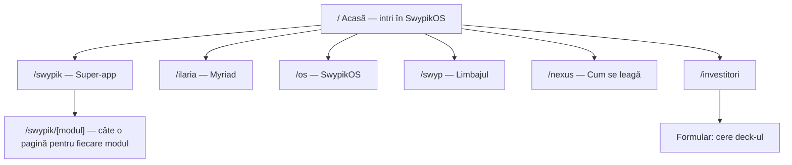

# Plan — swypik.com v2 („Alabaster”), un site pentru investitori pentru tot ecosistemul Nexus

## 1. Ce am găsit

| Zonă | Situația reală |
|---|---|
| **Site actual** (`site/`) | Astro 7 + Tailwind 4, **o singură pagină**, temă **întunecată**, waitlist pe Cloudflare D1. Prezintă doar 3 blocuri generice (Swypik / Ilaria / OS). |
| **Identitatea OS-ului** | Tema **„SwypikOS / Alabaster”**: luminoasă, fundal `#f5f5fb`, panouri de sticlă albe (glass), pete de culoare estompate (lila / cyan / roz), violet `#7c3aed`, font **Plus Jakarta Sans**, capsulă sus, bara Ilaria jos cu săgeata violet. **Site-ul actual nu seamănă deloc cu OS-ul.** |
| **Logo** | Plăcuța violet cu săgeata în sus (`favicon.svg`, gradient `#7C3AED→#A855F7`). Wordmark-ul din OS: **Swypik** (700) + **OS** (600). |
| **Swypik (super-app)** | Peste 20 de module în `swypik/commerce/lib/nav/modules.ts`: Video Commerce, Shop, Live, Missions, Creator Studio, Seller Portal (POS, Ads, Shopify), **Go**, **Food**, **Stays**, **Fly**, **Movies**, **Music**, **News**, **Arcade**, **Messenger**, Social, Wallet, Cares, AI Assistant, Kids, Admin. Pilotul mobil Expo are taburile Descoperă / Magazin / Ilaria / Cont. |
| **Ilaria** | IMC (Ilaria MicroCortex), antrenat de la zero, ternar 1,58-bit, până la IMC-1B. Rețeaua cognitivă distribuită **Myriad**. PCE Transfer v2 a trecut gate-ul de promovare (**+27,08 pp**). Pretraining-ul real încă nu a început. |
| **Swyp** | Limbaj pentru programe propuse de AI și verificate de compilator: „A generator proposes; the compiler and verifier dispose.” Viteza e la **~1,14× C**, cu overflow verificat. Backend-uri native x64/ARM64. |
| **SwypikOS** | Shell nativ Windows (Go/Win32, fără Electron). Prototip Linux ISO. **Kernel seed propriu** (UEFI, capabilities, IOMMU, **21/21 teste QEMU**, build reproductibil). Control Kernel și Compute Fabric. |

> [!WARNING]
> **Ce NU punem pe site** (conform `ramasite/docs/site/CLAIMS.md` și auditurilor):
> - moneda SWYP, Swypik Chain, mining/staking, Squad Buy, App Store pentru dezvoltatori (eliminate pe 25–26 sept.);
> - disponibilitate în App Store / Google Play;
> - cifre de utilizatori, GMV sau catalog (feed-ul public e gol, Stripe nu e activ);
> - Ilaria prezentată ca „înlocuitor GPT”;
> - SwypikOS prezentat ca OS complet care înlocuiește Windows deja azi.
>
> Pentru investitori, **credibilitatea vinde mai bine decât superlativele**. Fiecare modul primește un badge de status: `Live` · `Construit` · `În dezvoltare` · `Roadmap`. Arată ambițios, dar se poate verifica.

---

## 2. Direcția vizuală: „site-ul ESTE SwypikOS”

Ideea de bază: vizitatorul nu vede un landing page obișnuit, ci **intră în SwypikOS**.

- **Temă Alabaster 1:1 cu OS-ul.** Preiau tokenii din `swypik-os/ui/theme/palette.go`: fundal alabastru, sticlă `rgba(255,255,255,.65)` + `blur(28px)`, umbre violet, radius 22px, puncte violet după titluri („Your Swypik universe**.**”).
- **Wallpaper viu.** Cele 3 pete ambientale (lila, cyan, roz) se mișcă lent după cursor și scroll, iar arcele de sticlă traversează fundalul.
- **Capsula OS ca navigație.** Bara de sus e capsula reală: logo + „SwypikOS”, ora live, punctul verde, avatar.
- **Bara Ilaria ca element principal de interacțiune.** Jos pe ecran e mereu „Ask Ilaria or go anywhere…” cu săgeata violet. Dacă scrii `open go`, `open movies`, `ilaria` sau `investitori`, site-ul **navighează efectiv** acolo (un command palette scriptat, nu un AI fals). Pentru investitori e cel mai memorabil element.
- **Font Plus Jakarta Sans**, găzduit local (licență OFL, copiat din `swypik-os/ui/engine/fonts/`). Iconițe line 24px / 1,7px, aceleași ca în OS.
- **Mișcare:** tranziții între pagini (Astro View Transitions), reveal la scroll și mockup-uri de telefon care își schimbă ecranul la scroll (sticky scrollytelling). Respectă `prefers-reduced-motion`.
- Imersiv dar luminos. Doar secțiunile media (Movies, Music, Live) folosesc panouri întunecate, ca în aplicație.

---

## 3. Harta site-ului (multi-pagină, nu un simplu landing)

### `/` Acasă
1. **Hero = desktop-ul SwypikOS.** Capsulă, fereastra de sticlă cu „Your Swypik universe.” și grila de aplicații (exact ca în screenshot-ul OS-ului), bara Ilaria care tastează singură demonstrativ `open go…`. Titlu propus: **„Un ecosistem. Posibilitățile tale.”** / *„One ecosystem. Your possibilities.”*
2. **Trei straturi, un sistem:** Swypik (ce vede omul) → Ilaria (ce gândește) → SwypikOS (ce execută), cu Swyp ca liant de verificare.
3. **Universul Swypik:** grila interactivă cu toate modulele, filtrate pe aceleași categorii ca în OS (Shopping · Go & Food · Travel · Entertainment · Community · Business).
4. **Dovezi de inginerie** (cifre reale și verificabile, nu trafic): 21/21 teste kernel QEMU · ~2.447 teste automate în commerce · 7 limbi · ~1,14× C în Swyp · +27 pp PCE · 0 cod Linux copiat.
5. Bandă pentru investitori + waitlist.

### `/swypik` Super-app + `/swypik/[modul]`
O pagină-hub cu toate modulele, plus **o pagină dedicată pentru fiecare modul**, generată din același fișier de date. Fiecare pagină are: hero cu mockup de telefon animat, problema și soluția, 3–5 funcționalități cheie, modelul de venit, status și conexiunea cu Ilaria.

| Categorie | Module |
|---|---|
| **Shopping** | Swypik Video Commerce (Discover · Swipe · Buy) · Shop & Marketplace · Live Shopping · Anunțuri / Listings |
| **Go & Food** | **Swypik Go** (ride-hailing, 80% la șofer) · **Swypik Food** (livrare, dispatch în valuri) |
| **Travel** | **Swypik Stays** · **Swypik Fly** |
| **Entertainment** | **Movies** (micro-seriale verticale) · **Music** · **News** (știri AI cu sursă) · **Arcade** |
| **Community** | **Messenger** (DM, grupuri, apeluri video) · Social & profil · Swypik Cares · Swypik Kids |
| **Creatori & Business** | Missions · Creator Studio · Seller Portal (POS, Ads Manager, Shopify/Woo) |
| **Cont & bani** | Swypik Wallet · AI Shopping Assistant · Cont & Trust (2FA, Stripe Identity) |

Plus o secțiune separată, **„Aplicația mobilă”**: pilotul nativ Expo (Descoperă / Magazin / Ilaria / Cont), marcat „Pilot · în pregătire”.

### `/ilaria`
- **Vizualizare Myriad live (canvas):** mii de „celule cognitive” conectate, cu sinapse care se întăresc doar când un rezultat e verificat. Citat: *„One million situated cognitive cells, not one million dumb replicas.”*
- Scara IMC: 125M → 250M → 500M → **1B ternar 1,58-bit**, cu TritPack20 (20 trits într-un cuvânt de 32 de biți).
- Cei 7 piloni: Proof-Carrying Experience, Connectome, Thalamus, Collective Sleep, Lineage DAG…
- Memoria hipocampică locală, demonstrată ca o conversație animată.
- Status onest: arhitectura și pipeline-ul sunt construite, pretraining-ul urmează.

### `/os` SwypikOS
- Demo interactiv al shell-ului (taburile Home / Chat / Agent / Search / Files / Compute).
- Cele 3 trasee: Windows nativ (live) · Linux ISO (prototip) · **Kernel seed propriu** (UEFI → kernel, capabilities, IOMMU), cu un **terminal de boot animat** din pașii reali QEMU.
- Control Kernel („side effects require explicit capabilities”), Compute Fabric (opt-in, nu e crypto), sinteza de drivere cu canary și rollback.
- Viziunea Universal Native: desktop, telefon, edge, auto, roboți; x86-64 / ARM64 / RISC-V.

### `/swyp` Limbajul
Animație de tip pipeline: `intent → contract → candidate → verification → pinned source → deterministic build`. Include un exemplu `swyp judge` (PASS exhaustive / FAIL counterexample) și registrul de efecte închis.

### `/nexus` Cum se leagă
O diagramă animată a buclei: Ilaria propune un plan → Swyp îl verifică → SwypikOS acordă capabilități, execută și semnează chitanțe → Ilaria verifică dovezile. Mesajul: **„AI care propune, sistem care dovedește.”**

### `/investitori`
- **Teza:** nu există un echivalent local, conform UE, al TikTok Shop pentru România și CEE, iar deasupra lui stă un stack AI și OS propriu.
- **Model de business** (din `commerce.ts`): 10% marketplace · 5% afiliere creatori · Go 20/80 · Stays 10% · Movies/Music 70% la creator · Ads · Missions.
- **Piață:** România → CEE → UE, 7 limbi deja implementate.
- **Roadmap** vizual pe faze (flowchart), cu status pe fiecare pas.
- **De ce acum / moat:** model propriu, limbaj propriu, kernel propriu, date și infrastructură în UE.
- **Formular „Cere deck-ul”**, care refolosește `/api/waitlist` cu `source: "investor"`, fără backend nou.

### Programe și susținători („Backed by”)

O bandă de sticlă cu logo-urile programelor, afișată în trei locuri: pe **Acasă** (sub hero), pe **`/investitori`** (bloc mare) și pe **`/ilaria`** (doar EuroHPC, lângă secțiunea despre antrenare).

| Program | Logo | Text sub logo (cerut de tine) | Ce am găsit în proiect |
|---|---|---|---|
| 🇪🇺 **EuroHPC JU** | Steagul UE + sigla EuroHPC | „Research & Compute awarded by the European High-Performance Computing Joint Undertaking (EuroHPC JU) — MareNostrum 5 ACC” | Doar **propuneri trimise** pe 29 sept. (AI Factory Fast Lane, „Benchmark 138 submitted”). **Nicio decizie de acordare** în repo. |
| 🟦 **Microsoft for Startups** | Badge-ul oficial | „Member of Microsoft for Startups Founders Hub” | Doar ghidul de aplicare din `STARTUP-CREDITS-2026.md`. Fără confirmare de acceptare. |
| 🟧 **AWS Activate** | Badge-ul oficial | „Portfolio Member — AWS Activate” | Doar ghidul de aplicare. Nivelul **Portfolio** cere Org ID de la un Activate Provider; cel self-funded se numește **Founders**. |

> [!CAUTION]
> Pe un site pentru investitori, un logo de program afișat fără acceptare confirmată poate fi considerat **declarație înșelătoare** și poate duce la retragerea creditelor sau a grantului. Implementarea va fi astfel:
> - Fiecare program are în `src/data/backers.ts` un câmp `confirmed`. Banda apare **doar pentru programele confirmate**, așa că site-ul se poate construi acum și le activezi tu cu o singură linie.
> - **Logo-urile sunt doar fișierele oficiale** din kiturile de presă și din e-mailurile de acceptare, puse în `site/public/backers/`. Nu le redesenez. Ghidurile de brand (spațiu liber, fără recolorare, fără deformare) se respectă. Pentru UE folosesc emblema oficială și formularea exactă cerută în acordul de grant.
> - **Corectură factuală la AWS:** backend-ul rulează pe **Azure** (Sweden Central), iar CDN-ul e **Cloudflare**, nu AWS. Nota „backend și CDN accelerate de AWS” nu apare pe site. Textul rămâne doar statutul de membru.
> - **Microsoft:** „Founders Hub” a fost rebrand-uit. Folosesc exact numele din e-mailul tău de acceptare.

---

## 4. Implementare tehnică

- **Stack-ul rămâne Astro 7 + Tailwind 4**, static, fără framework JS greu. JS vanilla doar pentru: bara Ilaria, canvas-ul Myriad, scrollytelling și ceas.
- **Fișiere noi / modificate** (toate în `site/`):
  - `src/styles/tokens.css`: tokenii Alabaster din `palette.go`
  - `src/data/modules.ts`: **sursa unică** pentru toate modulele (nume, categorie, icon, status, copy RO/EN, venit)
  - `src/components/os/`: `Capsule`, `GlassWindow`, `IlariaBar`, `AppCard`, `Wallpaper`, `PhoneMockup`, `StatusBadge`
  - `src/components/viz/`: `MyriadCanvas`, `PipelineFlow`, `BootTerminal`
  - `src/pages/`: `index`, `swypik/index`, `swypik/[module]`, `ilaria`, `os`, `swyp`, `nexus`, `investitori` (+ privacy / terms / contact actualizate la noua temă)
  - `public/fonts/`: Plus Jakarta Sans (woff2)
  - `public/og-*.jpg`: imagini Open Graph noi pentru fiecare pagină
- **Testele existente** (`waitlist.test.mjs`) rămân valabile. Adaug o verificare de build care se asigură că fiecare modul din `modules.ts` are pagină, status și nicio formulare interzisă (SWYP, chain, App Store).
- **Git:** lucrez pe branch-ul `feat/site-alabaster`. Atenție: ești pe `chore/nexus-unify-20261003`, cu multe modificări necomise. Nu le ating și comit doar fișierele din `site/`. Planul se copiază și în `ramasite/agent-md/site/`.
- **Ca să vezi rezultatul:** `npm run dev` în `site/`, la `http://localhost:4321`. Fac și capturi desktop + mobil pentru verificare.

### Ordinea de lucru
1. Tokeni + layout + componentele OS (capsulă, sticlă, bara Ilaria, wallpaper)
2. Pagina Acasă, cu hero-ul OS → **prima previzualizare pentru tine**
3. `modules.ts` + hub-ul `/swypik` + cele ~22 pagini de modul
4. `/ilaria`, `/os`, `/swyp`, `/nexus`, cu vizualizările
5. `/investitori` + formular
6. Mobil, accesibilitate, Lighthouse, OG, `npm run build`, `npm test`, `git diff --check`

---

## 5. Decizii de la tine

1. **Limba:** (a) **RO + EN** cu comutator, recomandat pentru investitori; (b) doar EN; (c) doar RO.
2. **Badge-urile de status** pe module (`Live` / `În dezvoltare` / `Roadmap`) — le păstrăm? **Recomand da**: investitorii verifică.
3. **Swyp** primește o pagină proprie pe swypik.com, sau doar o secțiune în `/nexus`?
4. **Pagina de investitori:** ai date pe care vrei să le pun (echipă, mărimea rundei pre-seed, e-mail de contact), sau las placeholder-e clar marcate?
5. **„Nexus”:** e numele public al ecosistemului (de ex. „Swypik Nexus”), sau doar numele intern al repo-ului?
6. **Programele EuroHPC / Microsoft / AWS:** pentru fiecare, confirmă că ai **acceptarea scrisă** (e-mail sau acord de grant) și trimite-mi **logo-urile oficiale** (SVG/PNG din kitul programului). La AWS, ce nivel ai primit: **Founders** sau **Portfolio**? Până atunci, banda e construită, dar ascunsă.
