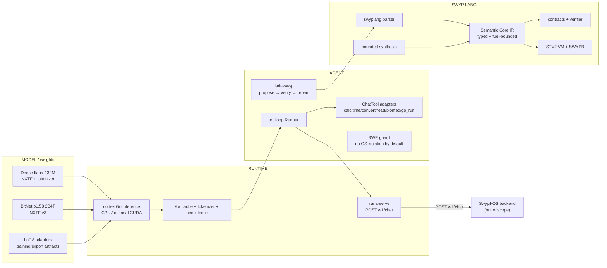

# SWOS-000 / M0 “Truth” — Audit Ilaria + Swyp Lang

**Task-kernel:** `task-muldzf3p-d3b3dedf`  
**Data auditului:** 2026-09-28  
**Checkout auditat:** `E:\nexus` + modulul Go separat `E:\nexus\swyp`  
**Repo Git:** `E:\nexus`, branch `main`, HEAD verificat la început `96290fa`  
**Scope exclus:** `E:\nexus\swypik-os` (auditat de alt worker)  
**Mod de lucru:** read-only în repo; singura scriere este acest raport.

> Verdict M0: există mult mai mult cod real decât un mock, dar Ilaria este în prezent un **stack mixt**: runtime Go real + modele/weights reale sau istorice + mecanisme de agent/tool-use reale, peste care există multe subsisteme de cercetare/prototip. Swyp are deja un seed tehnic serios (parser + Semantic Core IR + verifier + synthesis + STV2/SWYPB), dar încă nu este limbajul AI-native complet cerut de Stream C.

## Metodologie și reguli de clasificare

- **REAL** — implementare executabilă, consumată de alte componente și/sau acoperită de teste curente; nu înseamnă automat production-ready.
- **PROTOTYPE** — cod funcțional/compilabil, dar experimental, incomplet, fixture-only, limitat la demo/benchmark sau neintegrat în fluxul produsului.
- **STUB** — fallback/place-holder care declară interfața dar nu oferă capabilitatea reală pe acel backend/build.
- **DEAD** — artefact superseded/arhivă sau componentă fără rol activ în pipeline-ul curent identificat.
- Pentru afirmații de performanță/capabilitate: **VERIFIED** numai când există rezultat/test curent suficient; **UNVERIFIED** când există doar documentație/istoric sau testul real-checkpoint a fost skip-uit; **CONTRADICTED** când codul/testul actual infirmă explicit afirmația.

Au fost respectate interdicțiile din `AGENTS.md`: nu am citit `data/`, `cuda/`, `*.exe`, `*.zip`, `*.log`, `.env*`; nu am făcut checkout/commit/stash/clean, nu am pornit agenți, training, deploy sau provisionare.

---

# 1. Delimitare: MODEL vs RUNTIME vs AGENT vs LIMBAJ

## 1.1 MODEL

**Ce intră aici**
- Arhitectura și weights pentru dense Ilaria-130M: `cortex/transformer.go` + export/load NXTF; modelul are Forward, backprop și generation (`cortex/transformer.go:604-755`).
- BitNet b1.58 2B4T portat în runtime Go: structura de model este `BitNetModel` (`cortex/bitnet.go:49-130`), weights încărcate din NXTF v3 prin `LoadBitNetModel` (`cortex/bitnet_persist.go:47-106`).
- Adaptoare LoRA și weights exportate de pipeline-ul Python (forge).
- Artefactele de training/checkpoint/tokenizer sunt **model/data artifacts**, nu agent și nu runtime.

**Current-state**
- Ilaria-130M are rezultate locale reale în `results/local/ilaria130m_ll.json`, dar scorurile sunt slabe pe benchmark-urile generale.
- Stack-ul BitNet este implementat real, însă în baseline-ul de azi testele pe checkpoint real nu au rulat deoarece `ILARIA_BITNET_DIR` este unset.
- Cea mai recentă linie de fine-tuning evaluată în `results/` nu este automat „promovată”: project-v6 a fost explicit respins ca default din cauza regresiilor (`results/ilaria-project-v6/manual-review.json:465-471`).

## 1.2 RUNTIME

**Ce intră aici**
- Engine Go pentru tensor/transformer/BitNet, tokenization, KV cache, persistence, LoRA loading.
- `cortex/compute`: CPU real; GPU/CUDA optional; WebGPU/fallbacks.
- Headless HTTP server `cmd/ilaria-serve`.
- Swyp runtime: Core IR executor, STV2 VM, SWYPB loader/runtime.

**Current-state**
- CPU/runtime Go standard build trece vet și test.
- Backend-urile GPU reale există în surse build-tagged, dar build-ul standard folosește stubs, iar testele cu checkpoints reale/GPU nu au fost exercitate azi.
- `cmd/ilaria-serve` expune real `POST /v1/chat`, validează request/history și are teste (`cmd/ilaria-serve/main.go:40-150`).
- Interfața către SwypikOS este doar această limită: **SwypikOS backend → Ilaria `POST /v1/chat`**; SwypikOS nu a fost auditat aici.

## 1.3 AGENT

**Ce intră aici**
- Protocolul de tool-use model-driven: `ChatTool` + `Runner` în `cortex/toolloop.go`.
- CLI agent: `cmd/ilaria-chat`.
- Loop model→Swyp→counterexample: `cmd/ilaria-swyp` / `cortex/swyp_solve.go`.
- SWE execution guard: `cortex/swe`.
- Modulele `autonomous.go`, `self_training.go`, web learner etc. sunt mecanisme de cercetare/learning loops, nu echivalentul unui orchestrator software-agent complet.

**Dovadă importantă**
- Interfața agentului este reală: `ChatTool{Name, Describe, Call}` (`cortex/toolloop.go:60-72`), iar tool loop-ul are teste.
- `go_run` nu este un sandbox OS. Codul însuși spune explicit că execuția host este unsafe și trebuie opt-in (`cortex/toolloop.go:143-159`); `cortex/swe/sandbox_executor.go:26-72` dezactivează implicit execuția când nu există izolare OS.
- Prin urmare, **AGENT ≠ model** și **AGENT ≠ sandbox**.

## 1.4 LIMBAJ — Swyp

**Ce intră aici**
- Sintaxa/parserul Swyp: `swyp/internal/swyplang`.
- Semantic Core typed JSON IR: `swyp/internal/coreir`.
- Contract verification bounded: `coreir.Verify`.
- Synthesis enumerativ bounded: `swyp/internal/synthesis`.
- STV2 ternary VM + SWYPB module format: `swyp/internal/stv2`, `swyplang/stv2.go`, `swyplang/swypb.go`.
- CLI-uri: `cmd/swyp`, `cmd/swyp-stv2`.
- Ilaria poate **propune** cod; verifierul/runtime-ul Swyp nu necesită model la execuție.

Core IR are limite concrete: v1, 1 MiB, max 64 funcții, 256 blocuri, 512 slots, 8192 instrucțiuni, fuel 1M (`swyp/internal/coreir/ir.go:12-18`). Verificarea este explicit bounded testing, nu SMT proof (`swyp/internal/coreir/verify.go:55-58`).

### Diagramă



---

# 2. Clasificare real / prototype / stub / dead

## 2.1 `cortex/` — package root, grupat pe subsisteme

| Subsistem | Clasificare | Dovadă / observație |
|---|---|---|
| Dense transformer: `transformer*.go`, tensor, embedding, optimizer | **REAL** | `MiniTransformer` + forward/train/generate la `transformer.go:604-755`; numeroase teste, inclusiv optimizer/cache/backprop; package `ilaria/cortex` a trecut azi. |
| BitNet model/inference/decoder/persistence | **REAL** | `BitNetModel` `bitnet.go:78-106`; NXTF3 loader `bitnet_persist.go:101-106`; tests synthetic/tiny trec. Testul real checkpoint este env-gated și azi a fost skip implicit. |
| LoRA runtime | **REAL**, evaluare de model **PROTOTYPE** | `bitnet_lora*.go` + tests; rezultate project-v6 există, dar candidate v6 nu a fost promovat. |
| Tokenizers (BPE/Llama3/GPT2) | **REAL** | teste extensive `tokenizer*_test.go`; folosite de runtime/equivalence paths. |
| KV-cache / sampling / beam search | **REAL** | `transformer_cache_test.go`, `bitnet_decode_test.go`, sampling tests; consumate de CLI-urile reale. |
| Hippocampus + cognitive bridge / episodic memory | **PROTOTYPE** cu mecanism real | testul curent `TestContinualLearning_FactSurvivesRestart` trece; nu validează claim-uri generale de 89%/100 facts. |
| Semantic memory / working memory / predictor / confidence / prefrontal / workspace | **PROTOTYPE** | implementare + teste, dar README declară proiectul research prototype și benchmark-urile generale sunt slabe (`README.md:415-421`). |
| Reasoning / CoT / analogy | **PROTOTYPE** | `HARDCODING_AND_LIMITATIONS.md` documentează reasoning regex/symbolic; baseline istoric arată 23.8% pe hidden benchmark, deci nu este reasoning general. |
| RadioCortex / NeuroRadio / quantum / fractal / thousand-brains / expert shards | **PROTOTYPE** | multe teste, dar afirmații vechi de sparsity sunt contradictorii; testul curent produce 0.314%, nu 79.3%. |
| Vision SigLIP | **PROTOTYPE** | cod + teste real-checkpoint env-gated; `ILARIA_EYES_DIR` unset azi, deci capabilitatea real-weight/GPU nu a fost revalidată. |
| Audio Whisper | **PROTOTYPE** | plumbing real; README spune explicit „no trained projector yet” și random projector nu produce transcript real (`README.md:291-315`). |
| Tool loop `toolloop.go` | **REAL** mecanism, **PROTOTYPE** calitate agent | interface real + tests; model quality/tool selection rămâne limitată. |
| `autonomous.go`, `self_training.go`, web learner | **PROTOTYPE** | loops implementate, dar nu scheduler/orchestrator general de coding agents; nu confunda cu „autonomous kernel”. |
| Legacy `tools.go` pattern registry | **PROTOTYPE / legacy** | README îl contrastează cu actualul model-driven `toolloop.go` (`README.md:335-339`). |
| Swyp integration `swyp_solve.go`, `swyp_tool.go` | **PROTOTYPE** | tests + live demo docs, dar held-out 6/20 și 0/14 repaired; nu este încă capabilitate robustă. |
| Persistence/config/provenance | **REAL** | regression tests și consumatori în organism/toolloop; `runtimeguard` separat. |

## 2.2 Subpackages `cortex/*`

| Package | Clasificare | Dovezi/importatori |
|---|---|---|
| `ilaria/cortex/biomed` | **REAL** library, produs **PROTOTYPE** | multe teste; importat de `cortex/biomed_tool.go:17` și `cmd/ilaria-biomed/main.go:23`; live network dependency. |
| `ilaria/cortex/compute` | **REAL CPU**, **PROTOTYPE GPU**, **STUB pe backend-uri indisponibile în build standard** | `Engine` + CPU/mmap tests; importat de BitNet/tensor/vision/audio și CLI-uri. Go-list standard arată `cuda_stub.go`, `nvrtc_stub.go`, `webgpu_stub.go`; GPU real este build-tagged și nu a fost runtime-tested azi. |
| `ilaria/cortex/evalsuite` | **REAL harness**, scorer **DEFECT KNOWN** | importat de broca-eval/continual-bench; tests trec. `HARDCODING_AND_LIMITATIONS.md:298-335` documentează două false-positive bugs încă TODO. |
| `ilaria/cortex/swe` | **REAL safety guard**, executor izolat **STUB/ABSENT** | importat de toolloop; security tests trec. `sandbox_executor.go:26-72`: RunGo refuză fără OS-isolated executor; RunTrustedGo are host permissions. |

## 2.3 `internal/*` root

| Package | Clasificare | Dovadă |
|---|---|---|
| `ilaria/internal/runtimeguard` | **REAL** | importat de config/organism/toolloop; `atomicfile_test.go` + `runtimeguard_test.go`; baseline pass. |

## 2.4 `cmd/*` root — fiecare package

| Command package | Stare | Dovadă / rol |
|---|---|---|
| `cmd/bitnet-run` | **REAL** | loader BitNet + CPU/GPU decoder; `main.go:68`; runtime core testat indirect. |
| `cmd/broca-eval` | **PROTOTYPE** | eval real, dar scorerul are defecte cunoscute; `main.go:72`. |
| `cmd/broca-probe` | **PROTOTYPE** | diagnostic raw generation; `main.go:79`. |
| `cmd/bulk-ingest` | **PROTOTYPE / historical** | comentariul îl leagă de „Cursa E”; `main.go:40`; fără package tests. |
| `cmd/continual-bench` | **PROTOTYPE** | benchmark research; `main.go:169`; scorer/eval legacy. |
| `cmd/corpus-audit` | **PROTOTYPE tooling** | compilă; `main.go:95`; fără teste proprii. |
| `cmd/corpus-convert` | **PROTOTYPE tooling** | compilă; `main.go:34`; fără teste proprii. |
| `cmd/corpus-coverage` | **PROTOTYPE tooling** | compilă; `main.go:55`; fără teste proprii. |
| `cmd/corpus-eval-coverage` | **PROTOTYPE tooling** | folosește evalsuite; `main.go:169`; fără teste proprii. |
| `cmd/corpus-tokenize` | **PROTOTYPE tooling** | compilă; `main.go:32`; fără teste proprii. |
| `cmd/cortex` | **PROTOTYPE** | organism interactive legacy/research; are `demo_test.go`. |
| `cmd/cortex-autonomous` | **PROTOTYPE** | `main.go:16`; nu este orchestrator general. |
| `cmd/cortex-broca-train` | **PROTOTYPE / legacy training path** | `main.go:115`; auto-eval istoric; fără package tests. |
| `cmd/cortex-diagnose` | **PROTOTYPE diagnostic** | `main.go:13`. |
| `cmd/cortex-eval` | **PROTOTYPE** | `main.go:45`; benchmark legacy/small. |
| `cmd/cortex-learn-demo` | **PROTOTYPE demo** | `main.go:29`. |
| `cmd/cortex-tokenizer` | **PROTOTYPE tooling** | `main.go:39`; tokenizer library itself este real/testat. |
| `cmd/cortex-train` | **PROTOTYPE / legacy training** | `main.go:14`; nu este pipeline-ul principal BitNet LoRA actual. |
| `cmd/distill` | **PROTOTYPE** | `main.go:65`; fără dovadă current production run. |
| `cmd/gpt2-import` | **PROTOTYPE tooling** | `main.go:330`; converter functional, fără package test. |
| `cmd/ilaria-biomed` | **PROTOTYPE product CLI** | folosește package biomed real; `main.go:31`. |
| `cmd/ilaria-chat` | **REAL agent CLI** | `main.go:40`; `main_test.go` trece; toolloop este testat. Calitatea modelului rămâne prototype. |
| `cmd/ilaria-grounding-data` | **REAL experiment tooling** | `main.go:26`; rezultate grounding v3 există în `results/`. |
| `cmd/ilaria-hear` | **PROTOTYPE** | `main.go:104`; projector audio neantrenat conform README. |
| `cmd/ilaria-pilot-data` | **PROTOTYPE experiment tooling** | `main.go:26`; pilot-specific. |
| `cmd/ilaria-see` | **PROTOTYPE** | `main.go:89`; real-weight/GPU tests nu au rulat azi. |
| `cmd/ilaria-serve` | **REAL** | handler + security tests; `POST /v1/chat`; `main.go:40-150`. |
| `cmd/ilaria-swyp` | **PROTOTYPE closed loop** | tests trec; `main.go:3-19` descrie loop-ul; benchmark docs încă slab. |
| `cmd/nxtf-ppl` | **REAL eval utility** | `main.go:242`; `main_test.go` trece. |
| `cmd/nxtf-run` | **REAL runtime utility** | `main.go:28`; folosește MiniTransformer runtime testat. |
| `cmd/swyp-forge` | **REAL data/eval tooling** | produce trajectories verificate; `main.go:3-18`; `main_test.go` trece. |
| `cmd/tinystories-convert` | **PROTOTYPE / legacy data utility** | `main.go:25`; fără package tests. |
| `cmd/tok-encode` | **REAL deterministic utility** | `main.go:19`; folosește tokenizer testat. |
| `cmd/tok-stats` | **REAL diagnostic utility** | `main.go:18`; folosește tokenizer testat. |
| `cmd/train` | **PROTOTYPE / legacy organism trainer** | `main.go:58`; research stack, nu pipeline-ul actual BitNet/LoRA. |

**Observație:** lipsa unui `*_test.go` într-un command package nu înseamnă că binarul este dead; în baseline toate command packages au compilat. Am marcat multe CLI-uri research ca PROTOTYPE, nu DEAD.

## 2.5 `forge/` Python

| Pachet/subsistem | Stare | Dovadă |
|---|---|---|
| Model dens + training: `ilaria_model.py`, `train_ilaria.py`, `training_state.py` | **REAL implementation**, workflow dense **PROTOTYPE/legacy** | cod de training/export real; Ilaria-130M are results, dar strategia curentă de agent este BitNet + adapters. |
| NXTF: `nxtf.py`, `nxtf3.py`, `dump_logits.py`, fixtures | **REAL** | contract cu runtime Go; `cortex/forge_equivalence_test.go` și real-brain test env-gated. |
| BitNet import/reference: `import_bitnet.py`, `bitnet_reference.py` | **REAL tooling** | produce formatul citit de `LoadBitNetModel`; real-checkpoint current test nu a rulat azi. |
| Tokenizer/corpus/holdout: `hf_tokenizer.py`, `prepare_corpus.py`, `holdout.py`, `concat_streams.py` | **REAL tooling** | au teste Python în repo; nu au fost rerulate în acest audit deoarece DONE cere baseline Go. |
| Tool SFT/data: `tool_data.py`, `train_tools.py` | **REAL experiment pipeline** | teste Python existente; rezultate adapters/grounding/project în `results/`. |
| `forge/eval` | **REAL harness tooling**, suite **PARȚIALĂ** | `arena_en.py`; rezultat Ilaria-130M în `results/local/ilaria130m_ll.json`; provenance nu este încă un registry M3 complet. |
| `forge/multimodal` | **PROTOTYPE** | cod + tests; audio projector explicit neantrenat; real GPU fixtures env-gated. |
| `forge/swypforge` | **REAL experiment tooling** | `build_tasks.py` + `test_build_tasks.py`; complementar cu Go `cmd/swyp-forge`. |
| `forge/colab` experiment scripts/notebooks | **PROTOTYPE / campaign tooling** | multiple v2-v7 builders/runners; v7 pilot este pregătit dar **NOT executed** conform `docs/handoff/2026-09-28-colab-preflight.md:41-54,90-110`. |
| `Ilaria_Project_V7_Pilot.pre-bootstrap-fix.ipynb` | **DEAD / superseded artifact** | handoff-ul spune explicit DO NOT execute și indică notebook-ul corectat ca launch notebook. |
| old campaign notebooks/results PNG/TXT | **DEAD ca runtime**, **historical evidence** | nu sunt componente runtime; păstrate pentru audit/reproducibilitate. |

## 2.6 Swyp — fiecare package relevant

| Package | Stare | Dovezi |
|---|---|---|
| `swyp-lang/internal/coreir` | **REAL** | typed IR + executor + contracts + verifier; tests trec azi; importat de synthesis, swyplang lowering și cmd/swyp. |
| `swyp-lang/internal/swyplang` | **REAL** | parser/checker/interpreter/backends + Core lowering/STV2/SWYPB; tests trec azi. `ParseCore` separat la `swyp.go:57-64`. |
| `swyp-lang/internal/synthesis` | **REAL bounded synthesis** | `Synthesize` la `synthesis.go:55-71`; importat de cmd/swyp; tests trec. Nu este neural synthesis. |
| `swyp-lang/internal/stv2` | **REAL bounded VM** | 27 opcodes `v2.go:14-45`; tests trec; fără host FS/network/model opcodes. |
| `swyp-lang/internal/ilaria` | **PROTOTYPE** | backend/message glue, fără tests proprii; folosit de `cmd/swyp/draft.go` și `intent.go`; docs spun fixture-only pentru NL path. |
| `swyp-lang/cmd/swyp` | **REAL** | CLI principal, multe tests; core-run/verify/synth/module paths. |
| `swyp-lang/cmd/swyp-stv2` | **REAL** | assembler/VM CLI; `main_test.go` trece. |
| `swyp-lang/bridge/nexus` | **PROTOTYPE / legacy integration** | `tool.go` + test; docs spun că adapterul vechi `cortex.Tool` nu este înregistrat în Nexus curent. |
| `swyp/agent-lab/build-*/build.json` | **DEAD ca sursă; build evidence** | build snapshots indică hashes și previousExecutable; nu sunt package/runtime source. Fișierele `*.exe` nu au fost citite. |

### Ce NU este încă Swyp
- Nu este încă un model language/runtime pentru agenți.
- Nu are capability/effect system real; Core IR are câmp `Effects`, dar v1 cere efecte goale (`docs/SEMANTIC_CORE.md:159-162`).
- Nu are packages/modules complete, arrays/structs, debugger, incremental compilation, FFI Go/Rust/C/CUDA/WASM coerent.
- Contract verification este bounded execution/sampling, nu dovadă universală/SMT.
- STV2 este o VM deterministă pe hardware binar; „1.585 bits” este informație/trit, nu hardware ternar (`docs/STV2_ISA.md:21-24`).

---

# 3. Baseline efectiv rulat

Connectorul `run_command` disponibil nu expune câmpul `resourceClass`; am respectat timeout-ul cerut de 600000 ms. Prima încercare Swyp `go vet ./...` a fost blocată înainte de execuție de stratul connectorului și **nu este numărată ca rezultat**; comanda echivalentă PowerShell `& go vet ./...` a fost apoi executată.

## 3.1 Swyp — `E:\nexus\swyp`

### `go vet ./...`
- Command: `& go vet ./...`
- Timeout: 600000 ms
- **Exit code: 0**
- Timed out: false
- Duration: ~2.6 s
- stderr/stdout: empty.

### `go test -count=1 -timeout 180s ./...`
- Command: `& go test -count=1 -timeout 180s ./...`
- Timeout: 600000 ms
- **Exit code: 0**
- Timed out: false
- Duration: ~36.7 s

Packages:
- `ok swyp-lang/bridge/nexus`
- `ok swyp-lang/cmd/swyp`
- `ok swyp-lang/cmd/swyp-stv2`
- `ok swyp-lang/internal/coreir`
- `? swyp-lang/internal/ilaria [no test files]`
- `ok swyp-lang/internal/stv2`
- `ok swyp-lang/internal/swyplang`
- `ok swyp-lang/internal/synthesis`

**Niciun package nu a picat.**

## 3.2 Root Ilaria — `E:\nexus`

### `go vet ./...`
- Command: `& go vet ./...`
- Timeout: 600000 ms
- **Exit code: 0**
- Timed out: false
- Duration: ~13.6 s.

### `go test -count=1 -timeout 180s ./...`
- Command: `& go test -count=1 -timeout 180s ./...`
- Timeout: 600000 ms
- **Exit code: 0**
- Timed out: false
- Duration: ~42.9 s.

Tested packages cu teste:
- `ok ilaria/cmd/cortex`
- `ok ilaria/cmd/ilaria-chat`
- `ok ilaria/cmd/ilaria-serve`
- `ok ilaria/cmd/ilaria-swyp`
- `ok ilaria/cmd/nxtf-ppl`
- `ok ilaria/cmd/swyp-forge`
- `ok ilaria/cortex` (~33.5 s)
- `ok ilaria/cortex/biomed`
- `ok ilaria/cortex/compute`
- `ok ilaria/cortex/evalsuite`
- `ok ilaria/cortex/swe`
- `ok ilaria/internal/runtimeguard`

Restul `cmd/*` și `scripts/*` au compilat ca `[no test files]`.

**Niciun package nu a picat.**

## 3.3 Ce NU validează baseline-ul verde

La audit:
- `ILARIA_BITNET_DIR=<unset>`
- `ILARIA_BRAIN_DIR=<unset>`
- `ILARIA_EYES_DIR=<unset>`
- `ILARIA_EARS_DIR=<unset>`

Prin urmare testele real-checkpoint din `bitnet_equivalence_test.go:147-155`, `forge_brain_equivalence_test.go:34-43`, vision/audio sunt skip-gated și baseline-ul verde **nu revalidează weights reale sau GPU paths**.

Două teste țintite suplimentare au fost rulate:
1. `go test -count=1 -run TestNeuroRadioCortex_SparseSingle -v ./cortex` → **exit 0**, `314 / 100000 tiles (0.314%)`.
2. `go test -count=1 -run TestContinualLearning_FactSurvivesRestart -v ./cortex` → **exit 0**, fact survives restart; log: `8/12 generated tokens came from the recalled fact`.

---

# 4. Verificarea afirmațiilor README/docs

## 4.1 Model / eval / agent

| Afirmație | Status | Dovadă / motiv |
|---|---|---|
| Ilaria-130M ARC-C 23.5 / ARC-E 41.3 / HellaSwag 28.5 / PIQA 58.3 / WinoGrande 53.5 / MMLU 24.9 | **VERIFIED** | `results/local/ilaria130m_ll.json:3-39` reproduce valorile; README `317-333`. |
| Ilaria-130M este competitiv cu LLM-uri moderne | **CONTRADICTED chiar de README** | README `331-333,415-421` spune chance/near-chance și research prototype. |
| Ilaria-130M a fost antrenat pe ~3B tokens, val ppl 18.1, held-out Wiki 24.4 | **UNVERIFIED în acest audit** | afirmații în docs/handoff/funding, dar nu există rezultat curent identificat în `results/*.json|md` și real brain data este în `data/` interzis. |
| „89% one-shot continual-learning benchmark, 100 facts, 1% baseline” | **UNVERIFIED** | există un test mecanistic current pentru single fact/restart, dar nu artefactul benchmark-ului 100 facts în `results/`. |
| Fact single-exposure persistă peste restart și influențează generation | **VERIFIED** | test țintit actual: PASS; `continual_learning_test.go:9-18,59-128`; 8/12 generated tokens din recalled fact. |
| BitNet Go real checkpoint are KL ~0.007–0.016 și argmax ≥95% | **UNVERIFIED CURRENT** | testul există (`bitnet_equivalence_test.go:147-243`) dar `ILARIA_BITNET_DIR` este unset; azi a rulat doar fixture path. Comentariul conține măsurători istorice. |
| BitNet GPU 37–40 tok/s pe GTX 1660 Ti / argmax CPU-GPU identic | **UNVERIFIED CURRENT** | GPU real tests sunt env/build-tag gated; nu au fost rulate în baseline-ul de azi. |
| Vision SigLIP real checkpoint / GPU speedups | **UNVERIFIED CURRENT** | `ILARIA_EYES_DIR` unset; testele reale au fost skip. |
| Audio encoder equivalence + 73.1s→22.0s | **UNVERIFIED CURRENT** | README `291-315` documentează istoric, dar `ILARIA_EARS_DIR` unset; nu a fost rerulat. |
| Audio este speech-to-text utilizabil | **CONTRADICTED** | README `293,314-315`: projector neantrenat; random projector output nu este transcript real. |
| Tool loop este model-driven, nu regex ToolRegistry | **VERIFIED (mechanism)** | source `toolloop.go:60-72`; tests `toolloop_test.go` trec; README `335-346`. |
| Tools eval 5/8 selection, 0/6 false-call, 7/10 answer | **UNVERIFIED CURRENT / documented historical** | `docs/benchmarks/tools_eval.md` și README `354-365`; nu există current `results/` artifact și real checkpoint nu a fost exercitat azi. |
| Grounding v3: 57/59 pe suite manuală | **VERIFIED cu limitări** | `results/ilaria-grounding-v3/final-manual-review.json:1-15`; explicit small synthetic, non-blinded manual review. |
| project-v6 a crescut project 6/16→10/16 dar a regresat English 57/58→54/58 | **VERIFIED** | `results/ilaria-project-v6/run-summary.json:1-27`. |
| project-v6 este default/promoted | **CONTRADICTED** | `manual-review.json:465-471`: „Do not promote v6 as default”. |
| v6 Swyp code 4/4 compile/24 checks, dar 3/4 respectă function-name contract | **VERIFIED** | `results/ilaria-project-v6/manual-review.json:465`. |

## 4.2 Runtime / compute / research architecture

| Afirmație | Status | Dovadă / motiv |
|---|---|---|
| Go runtime CPU compilează/testează | **VERIFIED** | vet 0 + test 0 azi. |
| CUDA backend există | **VERIFIED ca implementare, UNVERIFIED runtime azi** | surse/build tags există; standard build folosește stubs; README însuși cere GPU/Windows runtime report separat `406-411`. |
| Linux GPU serving funcționează | **CONTRADICTED** | `docs/plans/2026-09-27-azure-budget-integration.md:35`: real bindings Windows-specific; Linux are stubs. |
| `go_run` rulează într-un „real sandbox” | **CONTRADICTED** | README `350-351` folosește termenul sandbox, dar source `toolloop.go:143-159` și `swe/sandbox_executor.go:26-72` spun explicit host permissions/no OS isolation. |
| RadioNeuron 0.24 ns, RadioBus 1.65 ns, RadioCortex 1.18/11.8 ms, sparse 26.3×, quantum 73.9×, NeuroRadio 15.2 ms | **UNVERIFIED CURRENT** | doar benchmark docs istorice; benchmark-urile nu au fost rerulate în M0. README `376-386` avertizează ulterior că benchmark-urile sunt locale/direcționale. |
| NeuroRadio activează ~79.3% din 100K | **CONTRADICTED** | doc vechi `RADIO_CORTEX_V0.md:203,228`; test actual produce **0.314%**; baseline doc `baseline_2026-05-24.md:78-82,104-110` avertizează aceeași contradicție. |
| NeuroRadio sparsity ~0.3% la testul synthetic single-frequency | **VERIFIED** | test actual exact: 314/100000 = 0.314%. |
| EvalSuite scores istorice sunt curate | **CONTRADICTED** | `HARDCODING_AND_LIMITATIONS.md:298-335` documentează false positives în `ModeContainsAny` și `ModeNumeric`. |
| „Autonomous learning loop” = agent orchestrator autonom | **CONTRADICTED ca interpretare** | codul are learning loop, dar nu task graph/scheduler/leases/verifier/capability isolation din M1; trebuie clasificat prototype, nu orchestrator. |
| „BPE tokenizer [ ]” din roadmap README este încă lipsă | **CONTRADICTED / stale roadmap** | există BPE tokenizer, tests și real-brain equivalence path; README roadmap `509` este învechit. |

## 4.3 Swyp Lang

| Afirmație | Status | Dovadă |
|---|---|---|
| Scalar parser/interpreter + C/JS backends funcționează | **VERIFIED la nivel de suite curentă** | package `internal/swyplang` pass; docs/README. |
| Semantic Core typed i64/f64 + JSON IR + fuel executor | **VERIFIED** | source `coreir/ir.go:12-45`; tests trec azi. |
| Contract verifier produce exhaustive/tested/counterexample/unknown/timeout | **VERIFIED** | `coreir/verify.go:36-58` + tests. |
| „exhaustive” = formal proof/universal theorem | **CONTRADICTED** | verifier source/docs spun explicit bounded finite-domain execution, nu SMT (`verify.go:55-58`; `SEMANTIC_CORE.md:192-195`). |
| STV2 are 27 opcodes | **VERIFIED** | `internal/stv2/v2.go:14-45`; package tests pass. |
| STV2 este hardware ternar nativ / 1.585 physical bits per trit | **CONTRADICTED** | `STV2_ISA.md:3-6,21-24` spune explicit Go VM + 5 trits/byte, nu hardware ternar. |
| SWYPB poate executa fără source/Go/GCC/Python/model service | **VERIFIED prin design/tests curente** | docs `DEVELOPMENT.md:17-22`; module/runtime tests pass. |
| Swyp are full capability/effect system | **CONTRADICTED** | Core v1 cere effects empty; roadmap îl listează Next. |
| Swyp are OS sandbox | **CONTRADICTED** | `SEMANTIC_CORE.md:131-133`: restricted runtime nu este advertised ca OS security sandbox. |
| Nexus bridge este live/registered | **CONTRADICTED** | `bridge/nexus/README.md` spune adapter vechi neînregistrat; current roadmap îl are Next. |
| Ilaria→Swyp demo 5/6 și heldout 6/20, repair 0/14 | **UNVERIFIED CURRENT / documented historical** | `docs/ILARIA_LOOP.md:24-38,76-94`; nu există rezultat M0 separat în `results/` și nu am rulat modelul/GPU. |
| Semantic Core research campaign 637k fuzz executions etc. | **UNVERIFIED CURRENT** | documentat în `SEMANTIC_CORE.md:227-267`; M0 baseline nu a rerulat race/fuzz campaign. |

### Regula de interpretare

Un `go test ./...` verde validează unit/integration tests disponibile în build-ul curent. **Nu** transformă automat în VERIFIED claims care depind de:
- checkpoints din `data/`;
- GPU build tags;
- variabile de mediu unset;
- benchmark-uri istorice nereexecutate;
- manual review datasets mici;
- documente care raportează rulări vechi.

---

# 5. Gap analysis — Stream B + Stream C

Legendă efort: **S** <2 engineer-days, **M** 3–7 zile, **L** 1–3 săptămâni, **XL** multi-week / dependent de design. Sunt estimări de complexitate, nu angajamente calendaristice.

## 5.1 Stream B — Ilaria

| Item misiune | Stare actuală | Dovadă / gap | Efort |
|---|---|---|---|
| B1. Separă model vs runtime vs agent | **PARTIAL → clarificat în acest M0** | codul le amestecă în package `cortex`, dar granițele tehnice sunt identificabile; lipsesc interfaces/package boundaries explicite. | M |
| B2. Benchmark suite internă | **PARTIAL** | arena EN reală, tools eval, grounding/project suites, hidden legacy; însă sunt fragmentate, mici și uneori au scoreri defecți. Nu există un singur canonical eval manifest/gate. | M |
| B3. Dataset/eval pipeline cu provenance | **PARTIAL** | există manifests/hashes în `results/ilaria-*`, holdout manifests și Swyp Forge split; nu există registry unic pentru source/license/transform/split/checkpoint/eval version. | L |
| B4. Strategie training/fine-tune/distill/RAG/tool-use fezabilă | **PARTIAL** | dense scratch training, BitNet LoRA, grounding/tool SFT, episodic memory și Swyp verification există; nu există ADR decizional cu go/no-go gates și cost/quality tradeoff. | M |
| B5. Măsoară permanent quality / latency / memory / tokens / energy | **GAP major** | quality are artefacte; latency și GPU memory apar punctual; tokens parțial; **energy nu este măsurată**; nu există benchmark telemetry schema unică. | L |
| B6. Scalează compute doar după gates | **NOT READY** | eval/provenance/gates nu sunt suficient consolidate; cloud GPU nu trebuie scalat încă. | dependent de B2–B5 |

### Compute inventariat, fără provisionare

| Resursă | Stare | Autorizare |
|---|---|---|
| Local CPU | 8 logical CPUs, ~15.9 GiB RAM raportate de host | **AVAILABLE / autorizat local** |
| Local GPU | NVIDIA GTX 1660 Ti, **6144 MiB**, driver 596.36; ~4789 MiB free la audit | **AVAILABLE / autorizat local** |
| Azure startup credit | documentat: $5,000 original, ~$4,977.19 remaining la auditul 2026-09-27 | **CREDIT existent**, dar nu înseamnă GPU autorizat/provisionat |
| Azure GPU | inventarul documentat spune **no GPU present**; GPU quota cerută, implicit 0 și în așteptare | **NEPROVISIONAT / quota approval not verified** |
| Colab Pro+ | existența abonamentului este documentată istoric; preflight 2026-09-28 spune v7 pilot NOT executed și GPU allocation not verified | **ACCOUNT/SUBSCRIPTION documented; current GPU UNVERIFIED** |
| AWS Activate $5k | urgent doc spune invitation active | **UNVERIFIED / nu este dovadă de credit redeem-uit sau buget autorizat** |
| EuroHPC | proposal file are status **DRAFT** | **NOT AUTHORIZED / no allocation evidence** |
| Brev 8×H200 | doar afirmație/plan în urgent doc | **NOT AUTHORIZED** |
| alte startup/GPU quota requests | cereri/planuri | **NOT AUTHORIZED până la grant explicit** |

Nu am provisionat, cumpărat sau propus achiziții.

## 5.2 Stream C — Swyp Lang

| Item misiune | Stare actuală | Dovadă / gap | Efort |
|---|---|---|---|
| Model semantic | **PARTIAL-REAL** | Core IR typed, CFG/functions/slots, checked i64/f64. Lipsește model pentru memory/effects/resources/tasks. | L |
| Syntax vs IR-first | **NEDECIS oficial; implementation already leans IR-first** | Semantic Core este opt-in IR-first slice; legacy syntax coexistă. Trebuie ADR care declară Core IR source of truth. | S |
| Type/effect system | **PARTIAL** | i64/f64/bool; `Effects []string` există dar v1 cere empty. | L |
| Capability/security types | **ABSENT** | restricted runtime are zero host opcodes; nu există typed capability tokens/authority flow. | L |
| Agent/task primitives | **ABSENT în limbaj** | agentul este extern în Go; Swyp nu are task/goal/approval/result primitive. | XL |
| Contracts + invariants + verification | **PARTIAL-REAL** | bounded contracts/verifier real; fără invariants de loop/state, SMT/symbolic proof sau proof artifacts independently checked. | L |
| Deterministic + probabilistic ops | **DETERMINISTIC real; probabilistic absent** | Core/STV2 deterministic; niciun RNG/effect/probability semantic contract. | M |
| FFI Go/Rust/C/CUDA/WASM | **GAP** | există legacy C emitter, dar nu FFI/ABI coherent și capability-safe pentru targeturile cerute. | XL |
| Compiler/interpreter/runtime | **PARTIAL-REAL** | parser, AST interpreter, Core IR executor, STV2 VM, C/JS emitters; frontend-uri încă bifurcate. | L |
| Package/module system | **ABSENT/very limited** | docs listează modules/packages ca next work. | L |
| Debugger/tracing | **GAP** | diagnostics/source locations există, dar nu debugger/step/trace model. | M |
| Incremental compilation | **ABSENT** | fără cache/dependency graph/incremental invalidation semantics. | L |
| Formalizable subset | **PARTIAL-REAL** | pure Core IR + finite contracts este candidatul natural; nu există formal spec independent/proof semantics. | L |
| AI-assisted synthesis reproducibil | **PARTIAL** | enumerative synthesis determinist + Ilaria proposer loop; model generation nu are manifest complet de model/prompt/sampler/seed/tool/verifier per artifact ca standard. | M |

### Gap decisiv

Swyp este deja mai mult decât „wrapper peste Go/Python”, dar **AI-native** nu este încă demonstrat prin semantica limbajului. Azi AI este în principal un **producer extern de source**, în timp ce runtime-ul Swyp rămâne deterministic. Pentru Stream C, AI-native ar trebui să însemne că task-uri, capabilities, evidence, nondeterminism și model calls au semantică explicită și auditabilă — nu că VM-ul însuși devine probabilistic.

---

# 6. Propunere M2 + M3

## M2 — Swyp Lang Seed

### P0

1. **ADR-001: IR-first ca source of semantic truth**
   - păstrează syntax Swyp ca frontend;
   - Core IR devine contractul stabil pentru verifier/runtime/backends;
   - legacy float AST path este compatibilitate, nu a doua semantică permanentă.

2. **Freeze „Core IR Seed”**
   - versiune explicită;
   - typed values;
   - deterministic execution + fuel;
   - canonical serialization/hash;
   - statusurile verifier păstrate strict: exhaustive/tested/counterexample/unknown/timeout.

3. **Introdu model minim effect/capability**
   - `pure` by default;
   - capability explicit pentru clock/fs-read/network/model/tool;
   - capability absent = operația nu poate fi reprezentată/executată;
   - niciun implicit ambient authority.

4. **3 demonstrații obligatorii, reproducibile**
   - **Demo A — pure verified:** `sum_to`/checked i64 cu finite exhaustive contract.
   - **Demo B — capability-gated task:** program care cere un mock `fs.read`/clock capability; fără capability → deterministic deny; cu capability explicit → traced result.
   - **Demo C — AI propose→verify→repair:** Ilaria propune un program pentru un contract held-out; Swyp produce counterexample; toate attempts + hashes + verdict sunt într-un manifest. Nu accepta code care nu trece verifierul.

5. **Benchmark M2**
   - parse/lower/prepare latency;
   - verify latency + cases/fuel;
   - module bytes;
   - deterministic replay hash;
   - peak RSS;
   - zero benchmark claims fără commit/hash/hardware metadata.

### P1
- liveness + register allocation/spilling;
- arrays/slices/structs cu aliasing explicit;
- loop invariants / richer contracts;
- trace format stabil;
- first-class task/result/evidence values;
- capability propagation through call graph.

### P2
- symbolic verifier pe subset cu `unknown` explicit;
- FFI ABI;
- WASM backend;
- tensor operations;
- package/module manager;
- incremental compiler;
- probabilistic operators cu RNG/effect provenance.

## M3 — Ilaria Eval/Training Pipeline

### P0

1. **Canonical eval harness**
   - un singur manifest pentru model/runtime/adapter/tokenizer/prompt/toolset/sampler/seed;
   - suites: language general, Romanian, grounding/honesty, tool-use, Swyp generation/repair, latency/memory;
   - scorer versioned; repară/înlocuiește scorerul legacy cu false positives și rescorează baseline-ul.

2. **Dataset provenance registry**
   - source URI/name + license;
   - immutable hash;
   - transformation pipeline hash;
   - split rationale;
   - contamination checks;
   - relation la eval tasks;
   - model/checkpoint lineage.

3. **Frozen holdout**
   - nu folosi final heldout pentru prompt/tuning iteration;
   - separă dev / validation / final transfer / broad benchmark.

4. **Baseline reproducibil**
   - BitNet base;
   - current promoted adapter (nu v6 dacă este explicit nepromovat);
   - Ilaria-130M unde este relevant;
   - aceeași runtime config pentru before/after.

### P1

5. **Experiment matrix explicit**
   - fine-tune vs retrieval/memory vs tool-use vs distillation;
   - go/no-go gate înainte de compute nou;
   - metricile obligatorii: quality, p50/p95 latency, peak RAM/VRAM, input/output tokens, energy când poate fi măsurată.

6. **Training run manifest**
   - parent weights SHA;
   - dataset SHA;
   - code HEAD;
   - exact hyperparameters;
   - hardware;
   - seed;
   - interruption/resume history;
   - exported artifact SHA.

7. **Promotion policy**
   - candidate nu devine default dacă îmbunătățește un suite și regresează baseline-ul critic;
   - project-v6 este exemplul corect de „do not promote”.

### P2

8. **Scale compute numai după P0/P1 gates**
   - benchmark throughput pe hardware autorizat;
   - cost-per-qualified-improvement;
   - stop criteria;
   - fără GPU fleet provisioning în M3 până când eval/provenance sunt stabile.

## ADR-uri candidate (6)

1. **ADR-SWYP-001 — IR-first vs syntax-first:** Core IR ca semantic authority; syntax doar frontend.
2. **ADR-SWYP-002 — Type/effect/capability system:** pure-by-default, no ambient authority.
3. **ADR-SWYP-003 — Determinism boundary:** RNG/model/network/clock ca effects explicite cu recorded evidence.
4. **ADR-SWYP-004 — Agent/task semantics:** task, approval, tool call, result, evidence, retry/repair ca primitive sau standard library protocol.
5. **ADR-SWYP-005 — Verification contract:** bounded execution vs symbolic proof; terminologie și statusuri care nu permit „tested” să fie raportat drept „proved”.
6. **ADR-ILARIA-001 — Model strategy:** decide pe benchmark dacă valoarea vine din fine-tune, distillation, RAG/episodic memory sau tools; scale compute numai după demonstrarea marginal gain.

---

# Concluzie M0

1. **Ilaria nu este un singur „model”**: este un sistem cu două familii de model (dense + BitNet/adapters), runtime Go, memory research și agent/tool layer.
2. **Runtime-ul Go este real și sănătos la build/test standard**, dar GPU/real-weight claims nu au fost revalidate azi.
3. **Agent loop-ul este real ca mecanism**, dar nu este încă un orchestrator general și nu are sandbox OS pentru host code.
4. **Swyp are deja fundație reală de limbaj**: parser + Core IR + verifier + synthesis + STV2/SWYPB.
5. **Swyp nu are încă elementele care îl fac AI-native la nivel semantic**: effects/capabilities, agent/task primitives, packages, debugger, incremental compile, FFI.
6. **Documentația conține claims stale/contradictorii**: cel mai clar este NeuroRadio 79.3% vs 0.314% current.
7. **Model quality este încă modestă/fragilă**: Arena 130M slabă; adapters pot îmbunătăți grounding/project tasks, dar v6 a regresat și corect nu a fost promovat.
8. **M2 ar trebui să consolideze ce există**, nu să rescrie compilerul de la zero.
9. **M3 trebuie să standardizeze adevărul experimental** înainte de orice compute scaling.
10. Nu există justificare tehnică din acest audit pentru provisionare sau cumpărare nouă de compute înainte de gates M3.

---

# Appendix A — Comenzi efectiv rulate

```powershell
# baseline Swyp
& go vet ./...
& go test -count=1 -timeout 180s ./...

# baseline root
& go vet ./...
& go test -count=1 -timeout 180s ./...

# targeted truth checks
& go test -count=1 -run 'TestNeuroRadioCortex_SparseSingle' -v ./cortex
& go test -count=1 -run 'TestContinualLearning_FactSurvivesRestart' -v ./cortex

# inventory / non-mutating
Get-CimInstance Win32_VideoController | Select-Object Name,AdapterRAM,DriverVersion
& nvidia-smi --query-gpu=name,memory.total,memory.free,driver_version --format=csv,noheader
& go list -f '{{.ImportPath}}|{{.GoFiles}}|{{.TestGoFiles}}' ./...
# plus Bridge read/list/search/outline/project_context/repo_map/git_status/git_log calls
```

# Appendix B — Interdicții respectate

- zero writes în `E:\nexus` și `E:\nexus\swyp`;
- zero acces la conținutul `data/`, `cuda/`, `*.exe`, `*.zip`, `*.log`, `.env*`;
- zero agenți/subworkers;
- zero training/GPU-heavy jobs;
- zero deploy/push;
- zero git mutation;
- zero provisioning/purchase.

# Appendix C — Final Git cleanliness

Verificare finală executată după scrierea raportului. Branch-ul este `main`, HEAD este `96290fa1d881b935e380f0dbed5a4e8d9b552834`, iar comanda obligatorie `git -C E:\nexus status --short` a produs exact:

```text
?? .mcp.json
```

**DONE condition satisfăcută:** în repo nu există alte modificări raportate de `git status --short`.
