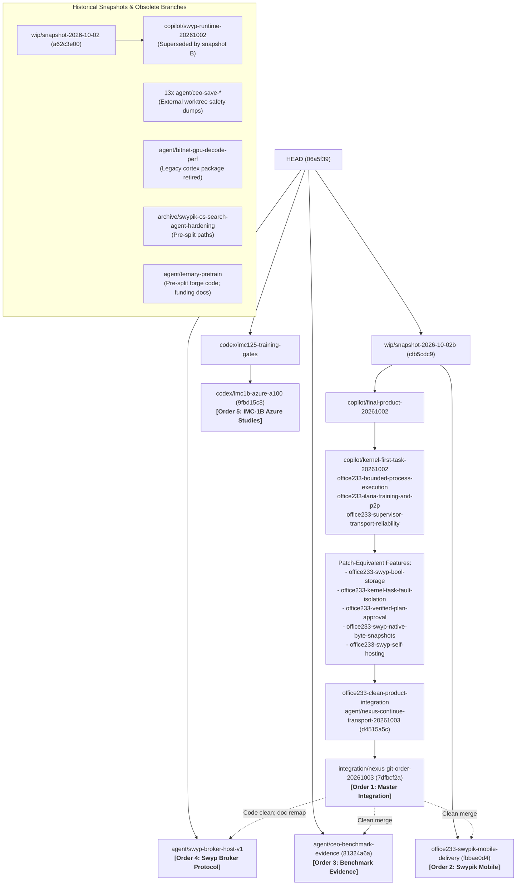

# Branch Triage & Unification Analysis (2026-10-03)

## Executive Summary

- **Integration Base (HEAD)**: `06a5f39f` (`codex/nexus-supervisor-v3`, integration base for `chore/nexus-unify-20261003`).
- **Local Branches Evaluated**: 108 total branches in repository; **37 branches** have commits not reachable from HEAD (`git rev-list --count HEAD..<branch> > 0`).
- **Key Structural Finding**: `integration/nexus-git-order-20261003` is a clean, 14-commit linear progression directly on top of HEAD (`06a5f39f`), absorbing the entire workspace reorg (`ramasite/`) and resolving work from **13 other branches** (`office233-*`, `copilot/*`, and `wip/snapshot-2026-10-02b`).
- **Triage Categorization**:
  - **INTEGRATE (5 branches across 4 batches)**: High-value, tested, distinct product additions ready for staged integration.
  - **SUPERSEDED (16 branches)**: Commits already applied or strictly subsumed by the integration superset or later evening snapshots.
  - **DROP-CANDIDATE (16 branches)**: Worktree snapshots (`agent/ceo-save-*`, `wip/snapshot-*`), retired legacy packages (`agent/bitnet-gpu-decode-perf`), or archival WIP (`archive/swypik-os-search-agent-hardening`).

## 1. Summary Table

| # | Branch | Tip Date | Commits | Products | Relocated | Conflicts (HEAD) | Recommendation | Order / Batch |
|---|--------|----------|---------|----------|-----------|------------------|----------------|---------------|
| 1 | `integration/nexus-git-order-20261003` | 2026-10-03 | 14 | ilaria, r/README.md, r/RE... | 22/1026 | 0 | **INTEGRATE** | Order 1 (B1) |
| 2 | `office233-swypik-mobile-delivery` | 2026-10-02 | 2 | ilaria, r/agent-md, r/ben... | 168/774 | 0 | **INTEGRATE** | Order 2 (B2) |
| 3 | `agent/ceo-benchmark-evidence` | 2026-10-02 | 1 | r/benchmarks | 0/98 | 0 | **INTEGRATE** | Order 3 (B3) |
| 4 | `agent/swyp-broker-host-v1` | 2026-09-29 | 3 | r/docs, swypik-os | 1/17 | 0 | **INTEGRATE** | Order 4 (B3) |
| 5 | `codex/imc1b-azure-a100` | 2026-10-01 | 7 | ilaria, r/agent-md, r/ben... | 63/181 | 2 | **INTEGRATE** | Order 5 (B4) |
| 6 | `agent/nexus-continue-transport-20261003` | 2026-10-02 | 11 | ilaria, r/agent-md, r/ben... | 168/759 | 0 | **SUPERSEDED** | Subsumed |
| 7 | `codex/imc125-training-gates` | 2026-10-01 | 6 | ilaria, r/agent-md, r/ben... | 61/176 | 2 | **SUPERSEDED** | Subsumed |
| 8 | `copilot/final-product-20261002` | 2026-10-02 | 2 | ilaria, r/agent-md, r/ben... | 168/728 | 0 | **SUPERSEDED** | Subsumed |
| 9 | `copilot/kernel-first-task-20261002` | 2026-10-02 | 5 | ilaria, r/agent-md, r/ben... | 168/738 | 0 | **SUPERSEDED** | Subsumed |
| 10 | `copilot/swyp-runtime-20261002` | 2026-10-02 | 4 | ilaria, r/agent-md, r/ben... | 168/727 | 0 | **SUPERSEDED** | Subsumed |
| 11 | `office233-bounded-process-execution` | 2026-10-02 | 5 | ilaria, r/agent-md, r/ben... | 168/738 | 0 | **SUPERSEDED** | Subsumed |
| 12 | `office233-clean-product-integration` | 2026-10-02 | 11 | ilaria, r/agent-md, r/ben... | 168/759 | 0 | **SUPERSEDED** | Subsumed |
| 13 | `office233-ilaria-training-and-p2p` | 2026-10-02 | 5 | ilaria, r/agent-md, r/ben... | 168/738 | 0 | **SUPERSEDED** | Subsumed |
| 14 | `office233-kernel-task-fault-isolation` | 2026-10-02 | 5 | ilaria, r/agent-md, r/ben... | 168/738 | 0 | **SUPERSEDED** | Subsumed |
| 15 | `office233-supervisor-transport-reliability` | 2026-10-02 | 5 | ilaria, r/agent-md, r/ben... | 168/738 | 0 | **SUPERSEDED** | Subsumed |
| 16 | `office233-swyp-bool-storage` | 2026-10-02 | 5 | ilaria, r/agent-md, r/ben... | 168/738 | 0 | **SUPERSEDED** | Subsumed |
| 17 | `office233-swyp-native-byte-snapshots` | 2026-10-02 | 7 | ilaria, r/agent-md, r/ben... | 168/744 | 0 | **SUPERSEDED** | Subsumed |
| 18 | `office233-swyp-self-hosting` | 2026-10-02 | 9 | ilaria, r/agent-md, r/ben... | 168/749 | 0 | **SUPERSEDED** | Subsumed |
| 19 | `office233-verified-plan-approval` | 2026-10-02 | 5 | ilaria, r/agent-md, r/ben... | 168/744 | 0 | **SUPERSEDED** | Subsumed |
| 20 | `wip/snapshot-2026-10-02b` | 2026-10-02 | 1 | ilaria, r/agent-md, r/ben... | 168/727 | 0 | **SUPERSEDED** | Subsumed |
| 21 | `agent/bitnet-gpu-decode-perf` | 2026-09-24 | 1 | workspace | 0/6 | 3 | **DROP-CANDIDATE** | Drop / Review |
| 22 | `agent/ceo-save-repo-separation-swyp2` | 2026-10-02 | 2 | ilaria, r/agent-md, r/ben... | 52/603 | 576 | **DROP-CANDIDATE** | Drop / Review |
| 23 | `agent/ceo-save-swos-compute-fabric-m1` | 2026-10-02 | 1 | r/docs, swypik-os | 1/11 | 0 | **DROP-CANDIDATE** | Drop / Review |
| 24 | `agent/ceo-save-swos-control-kernel-m1` | 2026-10-02 | 1 | r/docs, swypik-os | 1/12 | 5 | **DROP-CANDIDATE** | Drop / Review |
| 25 | `agent/ceo-save-swos-device-synthesis-m1` | 2026-10-02 | 1 | r/docs, swypik-os | 2/8 | 3 | **DROP-CANDIDATE** | Drop / Review |
| 26 | `agent/ceo-save-swos-ilaria-cognitive-m1` | 2026-10-02 | 1 | r/docs, workspace | 1/4 | 0 | **DROP-CANDIDATE** | Drop / Review |
| 27 | `agent/ceo-save-swos-install-adapt-m1` | 2026-10-02 | 1 | swypik-os | 0/5 | 0 | **DROP-CANDIDATE** | Drop / Review |
| 28 | `agent/ceo-save-swos-native-kernel-seed-m1` | 2026-10-02 | 1 | workspace | 0/25 | 0 | **DROP-CANDIDATE** | Drop / Review |
| 29 | `agent/ceo-save-swos-os-platform-m1` | 2026-10-02 | 1 | r/docs, swypik-os | 3/27 | 1 | **DROP-CANDIDATE** | Drop / Review |
| 30 | `agent/ceo-save-swos-security-p0` | 2026-10-02 | 1 | r/docs, swypik-os | 1/5 | 1 | **DROP-CANDIDATE** | Drop / Review |
| 31 | `agent/ceo-save-swos-swyp-effects-m1` | 2026-10-02 | 1 | r/docs, swyp | 3/9 | 4 | **DROP-CANDIDATE** | Drop / Review |
| 32 | `agent/ceo-save-swos-universal-adaptive-m2` | 2026-10-02 | 1 | r/benchmarks, r/docs, swy... | 10/253 | 25 | **DROP-CANDIDATE** | Drop / Review |
| 33 | `agent/ceo-save-swyp-hir-p3` | 2026-10-02 | 1 | r/experiments | 0/264 | 0 | **DROP-CANDIDATE** | Drop / Review |
| 34 | `agent/ceo-save-swypik-os-swyp-broker` | 2026-10-02 | 1 | r/experiments | 0/264 | 0 | **DROP-CANDIDATE** | Drop / Review |
| 35 | `agent/ternary-pretrain` | 2026-09-29 | 19 | r/docs, workspace | 5/18 | 17 | **DROP-CANDIDATE** | Drop / Review |
| 36 | `archive/swypik-os-search-agent-hardening` | 2026-09-28 | 1 | workspace | 0/27 | 17 | **DROP-CANDIDATE** | Drop / Review |
| 37 | `wip/snapshot-2026-10-02` | 2026-10-02 | 1 | ilaria, r/agent-md, r/ben... | 167/720 | 0 | **DROP-CANDIDATE** | Drop / Review |

## 2. Containment Graph

The graph below illustrates how the 37 unmerged branches relate to each other. Notice how `integration/nexus-git-order-20261003` forms the master integration backbone absorbing 13 branches, while `office233-swypik-mobile-delivery`, `agent/ceo-benchmark-evidence`, `agent/swyp-broker-host-v1`, and `codex/imc1b-azure-a100` supply modular product additions.



## 3. Proposed Integration Order (Numbered List of Batches)

The 5 valuable branches should be integrated sequentially in **4 batches** to maximize safety, enable clean validation gates at each boundary, and eliminate duplicated reviews.

### Batch 1: Core Foundation & Master Integration Backbone
#### Order 1: `integration/nexus-git-order-20261003` (14 commits)
- **Purpose**: Establishes the authoritative repository baseline on top of `HEAD` (`06a5f39f`). Delivers kernel boot under OVMF/QEMU, isolated ring 3 init task execution, desktop font readiness, Swyp raw64 bool storage, immutable u64 byte snapshots, live SSA phi pruning, HIR duplicate call loan rejection, kernel fault confinement, verified-plan host approval coordinator, and clean checkout validation gates.
- **Branches Subsumed & Closed (13)**:
  1. `office233-clean-product-integration` (direct ancestor)
  2. `agent/nexus-continue-transport-20261003` (direct ancestor)
  3. `copilot/final-product-20261002` (direct ancestor)
  4. `copilot/kernel-first-task-20261002` (direct ancestor)
  5. `office233-bounded-process-execution` (direct ancestor)
  6. `office233-ilaria-training-and-p2p` (direct ancestor)
  7. `office233-supervisor-transport-reliability` (direct ancestor)
  8. `wip/snapshot-2026-10-02b` (direct ancestor)
  9. `office233-kernel-task-fault-isolation` (patch-equivalent)
  10. `office233-swyp-bool-storage` (patch-equivalent)
  11. `office233-verified-plan-approval` (patch-equivalent)
  12. `office233-swyp-native-byte-snapshots` (patch-equivalent)
  13. `office233-swyp-self-hosting` (patch-equivalent)
- **Integration Method**: Fast-forward merge (`git merge --ff-only integration/nexus-git-order-20261003`). Linear history on top of HEAD.
- **Tests to Run**:
  ```powershell
  powershell -File ramasite/scripts/verify-supervisor-v3.ps1
  powershell -File ramasite/scripts/verify-contracts.ps1
  python ramasite/scripts/run-python-tests.py
  ```

### Batch 2: Mobile Product Delivery
#### Order 2: `office233-swypik-mobile-delivery` (1 commit: `fbbae0d4`)
- **Purpose**: Provisions the official `swypik/mobile/` product tree (47 files, 14,087 insertions). Contains React Native / Expo application, AuthProvider, IlariaScreen, StudioPreview, contribution panels, and comprehensive test suite with provenance records.
- **Integration Method**: Cherry-pick commit `fbbae0d4` on top of Batch 1 (or merge branch). Zero merge conflicts against `integration/nexus-git-order-20261003`.
- **Tests to Run**:
  ```bash
  npm --prefix swypik/mobile test
  powershell -File ramasite/scripts/verify-contracts.ps1
  ```

### Batch 3: Platform Expansion (Benchmarks & Swyp Broker)
#### Order 3: `agent/ceo-benchmark-evidence` (1 commit: `81324a6a`)
- **Purpose**: Curated CEO benchmark source and dated evidence across Swyp and SwypikOS under `ramasite/benchmarks/` (98 files changed, 16,351 insertions). Zero binaries, clean provenance.
- **Integration Method**: Cherry-pick commit `81324a6a` (or merge). Zero merge conflicts against Batch 1 baseline.
- **Tests to Run**:
  ```bash
  git diff --check ramasite/benchmarks
  ```

#### Order 4: `agent/swyp-broker-host-v1` (3 commits: `5402553a`, `60810f39`, `22dd9504`)
- **Purpose**: Implements Swyp broker host protocol, scoped policy adapters, and kernel authority binding under `swypik-os/core/swypbroker/` (17 files, 2,515 insertions).
- **Integration Method**: Cherry-pick commits `5402553a`, `60810f39`, `22dd9504`. All Go code merges cleanly with zero conflicts. Path remap required for `swypik-os/docs/SWYP_BROKER_PROTOCOL.md` -> `ramasite/docs/swypik-os/SWYP_BROKER_PROTOCOL.md`.
- **Tests to Run**:
  ```bash
  go test ./swypik-os/core/swypbroker/...
  ```

### Batch 4: Cognition & Model Studies
#### Order 5: `codex/imc1b-azure-a100` (1 commit: `9fbd15c8`)
- **Purpose**: Adds IMC-1B studies for 8x Azure A100 GPUs, including `imc_1b_azure_plan.json`, `imc_1b_azure_plan.py`, unit test suite `test_imc_1b_azure_plan.py`, and runbook.
- **Integration Method**: Cherry-pick commit `9fbd15c8` with path remapping for `ilaria/docs/runbooks/IMC_1B_AZURE_A100_TRAINING.md` -> `ramasite/docs/ilaria/runbooks/IMC_1B_AZURE_A100_TRAINING.md`.
- **Tests to Run**:
  ```bash
  pytest ilaria/forge/test_imc_1b_azure_plan.py
  ```

## 4. List Needing User Decision

Before executing or archiving remaining branches, user confirmation is requested on the following 4 decisions:

### Decision 1: Training Lineage & Launch Gates in `codex/imc1b-azure-a100` (`b95fc112`, `b14418e7`)
- **Context**: Commits `b95fc112` and `b14418e7` add persistent Colab launch gates (`colab_training_supervisor.py`, `split_lineage.py`) and checkpoint generation pinning. However, they conflict with newer edits to `ilaria/forge/train_ilaria.py` and `dataset_manifest.py`.
- **Options**:
  1. *(Recommended)* Integrate only the 1B Azure study (`9fbd15c8`, Order 5) and port `split_lineage.py` as an isolated utility.
  2. Perform a manual 3-way reconciliation of `train_ilaria.py` to merge Colab training supervisor logic.
  3. Discard the training gates commits and rely on current `train_ilaria.py`.

### Decision 2: European HPC & Cloud Startup Funding Documents in `agent/ternary-pretrain`
- **Context**: Commits `be6004d7` through `0c2d75c5` contain formal grant/funding application text (`docs/funding/`: Scaleway, OVHcloud, EuroHPC proposals, registered VAT numbers). The code commits in this branch are obsolete, but the grant text is unique.
- **Options**:
  1. *(Recommended)* Cherry-pick the 4 funding markdown documents into `ramasite/docs/workspace/funding/`.
  2. Drop the branch entirely without migrating the funding documents.

### Decision 3: Unmerged Compute Fabric Package in `agent/ceo-save-swos-compute-fabric-m1`
- **Context**: Commit `b86d969f` contains `swypik-os/core/computefabric/` (coordinator, policy, crypto, verifier, aggregation; 11 files, 2,436 lines). This package was not merged into HEAD or the integration branch.
- **Options**:
  1. *(Recommended)* Keep branch archived; do not integrate into main until Compute Fabric architecture review is scheduled.
  2. Integrate `swypik-os/core/computefabric/` and run its unit tests (`computefabric_test.go`, `adversarial_test.go`).
  3. Drop branch completely.

### Decision 4: Archival Branch Cleanup (16 Drop Candidates)
- **Branches**:
  - 13 Worktree dumps: `agent/ceo-save-*` (`repo-separation-swyp2`, `swos-*`, `swyp-hir-p3`, `swypik-os-swyp-broker`)
  - 1 Retired package: `agent/bitnet-gpu-decode-perf` (legacy `cortex/` package retired in product split)
  - 1 Archival WIP: `archive/swypik-os-search-agent-hardening`
  - 1 Precursor snapshot: `wip/snapshot-2026-10-02`
- **Options**:
  1. *(Recommended)* Keep branches as historical tags/refs (read-only reference) without integrating.
  2. Delete local branches once Batch 1-4 integration completes.

## 5. Detailed Per-Branch Assessment

### `integration/nexus-git-order-20261003`
- **Recommendation**: **INTEGRATE** (Order 1, Batch 1)
- **Tip SHA & Date**: `7dfbcf2a` (2026-10-03T10:02:09+03:00)
- **Unique Commits**: 14 (Cherry: `+14 / -0`)
- **Products Touched**: ilaria, ramasite/README.md, ramasite/RELOCATIONS.json, ramasite/agent-md, ramasite/benchmarks, ramasite/docs, ramasite/scripts, swyp, swypik-os, workspace
- **Files Changed vs Merge-Base**: 1026 (22 relocated paths)
- **Diffstat Summary**: ` 1026 files changed, 131089 insertions(+), 6073 deletions(-)`
- **Merge-Tree vs HEAD**: Exit `0`, Conflicts: `0`
- **Feature Summary**: Unified integration master branch containing 14 commits: workspace layout reorg (ramasite/), QEMU runtime parity, EFI boot under OVMF/QEMU, isolated ring-3 init task, desktop font readiness, Swyp raw64 bool storage, immutable u64 byte snapshots, live SSA phi pruning, HIR duplicate call loan rejection, kernel fault confinement, verified-plan host approval, and clean checkout gates/whitespace hygiene.
- **Quality Assessment**: High. Fully self-consistent, comprehensive Go/C unit tests and verification scripts included.
- **Risk**: Low. Sits linearly on top of current HEAD (06a5f39), fast-forward compatible.
- **Suggested Method**: Fast-forward merge or linear git merge of integration/nexus-git-order-20261003 into HEAD.
- **Tests to Run**: `powershell -File ramasite/scripts/verify-supervisor-v3.ps1; powershell -File ramasite/scripts/verify-contracts.ps1; python ramasite/scripts/run-python-tests.py`
- **Commits**:
  - `7dfbcf2a` chore(nexus): clean inherited whitespace without rewriting historical console evidence (2026-10-03)
  - `6360ab2f` docs(nexus): record final passing Python validation for integration (2026-10-03)
  - `3edde601` chore(nexus): organize tracked support paths and restore reproducible checkout gates (2026-10-03)
  - `d4515a5c` feat(planapproval): add bounded verified-plan host approval coordinator (2026-10-02)
  - `02533f37` feat(kernel): confine admitted init faults and resume healthy user stacks (2026-10-02)
  - `0a181e98` Reject duplicate exclusive HIR call loans (2026-10-02)
  - `b17b36c7` fix(coreir): prune SSA phis by live incoming slots (2026-10-02)
  - `aceef75c` feat(coreir): snapshot bounded u64 storage into immutable bytes (2026-10-02)
  - `ae9c0cc3` Support canonical bool leaves in Swyp raw64 storage (2026-10-02)
  - `99195e54` fix(bench): wait for actual desktop font readiness before resource sampling (2026-10-02)
  - `017a2a50` fix(ci): keep QEMU runtime parity configuration compatible with checkout preflight (2026-10-02)
  - `501e38e5` feat(kernel): execute explicit init task in isolated ring 3 with bounded preemption (2026-10-02)
  - `0ddda280` fix(kernel): native EFI kernel now boots under OVMF/QEMU to the runtime handoff (2026-10-02)
  - `cfb5cdc9` wip: safety snapshot B of E:\nexus working tree 2026-10-02 evening (2026-10-02)

### `office233-swypik-mobile-delivery`
- **Recommendation**: **INTEGRATE** (Order 2, Batch 2)
- **Tip SHA & Date**: `fbbae0d4` (2026-10-02T23:35:14+03:00)
- **Unique Commits**: 2 (Cherry: `+2 / -0`)
- **Products Touched**: ilaria, ramasite/agent-md, ramasite/benchmarks, ramasite/docs, ramasite/scripts, swyp, swypik-os, swypik/mobile, workspace
- **Files Changed vs Merge-Base**: 774 (168 relocated paths)
- **Diffstat Summary**: ` 774 files changed, 134422 insertions(+), 4394 deletions(-)`
- **Merge-Tree vs HEAD**: Exit `0`, Conflicts: `0`
- **Feature Summary**: Provisions provenance-backed migrated source baseline for swypik/mobile (commit fbbae0d4). 47 files, React Native / Expo application, AuthProvider, IlariaScreen, contribution panels, and comprehensive test suite.
- **Quality Assessment**: Production-ready baseline with source provenance hashes and tests (auth.test.ts, api.test.ts, ilaria-lifecycle.test.ts).
- **Risk**: Low. Touches only swypik/mobile/ which is currently absent in HEAD and integration branch.
- **Suggested Method**: Cherry-pick commit fbbae0d4 (or merge). Merges with zero conflicts onto integration/nexus-git-order-20261003.
- **Tests to Run**: `npm --prefix swypik/mobile test; powershell -File ramasite/scripts/verify-contracts.ps1`
- **Commits**:
  - `fbbae0d4` chore(mobile): provision provenance-backed migrated source baseline (2026-10-02)
  - `cfb5cdc9` wip: safety snapshot B of E:\nexus working tree 2026-10-02 evening (2026-10-02)

### `agent/ceo-benchmark-evidence`
- **Recommendation**: **INTEGRATE** (Order 3, Batch 3)
- **Tip SHA & Date**: `81324a6a` (2026-10-02T22:56:11+03:00)
- **Unique Commits**: 1 (Cherry: `+1 / -0`)
- **Products Touched**: ramasite/benchmarks
- **Files Changed vs Merge-Base**: 98 (0 relocated paths)
- **Diffstat Summary**: ` 98 files changed, 16351 insertions(+)`
- **Merge-Tree vs HEAD**: Exit `0`, Conflicts: `0`
- **Feature Summary**: Preserves curated CEO benchmark source and dated evidence across Swyp and SwypikOS under ramasite/benchmarks/ (commit 81324a6a). 98 files changed, 16,351 insertions.
- **Quality Assessment**: Curated benchmark data and results, clean provenance, no binaries.
- **Risk**: Low. Touches only ramasite/benchmarks/. Zero merge conflicts with HEAD and integration branch.
- **Suggested Method**: Cherry-pick commit 81324a6a (or merge).
- **Tests to Run**: `git diff --check ramasite/benchmarks`
- **Commits**:
  - `81324a6a` bench: preserve curated CEO source and dated evidence (2026-10-02)

### `agent/swyp-broker-host-v1`
- **Recommendation**: **INTEGRATE** (Order 4, Batch 3)
- **Tip SHA & Date**: `22dd9504` (2026-09-29T21:09:57+03:00)
- **Unique Commits**: 3 (Cherry: `+3 / -0`)
- **Products Touched**: ramasite/docs, swypik-os
- **Files Changed vs Merge-Base**: 17 (1 relocated paths)
- **Diffstat Summary**: ` 17 files changed, 2515 insertions(+)`
- **Merge-Tree vs HEAD**: Exit `0`, Conflicts: `0`
- **Feature Summary**: Adds Swyp broker host protocol, scoped policy adapters, and kernel authority binding in swypik-os/core/swypbroker (commits 5402553a, 60810f39, 22dd9504). 17 files, 2,515 insertions.
- **Quality Assessment**: High. Complete Go implementation with unit tests (broker_test.go, protocol_test.go, policy_test.go, kernel_test.go, chameleon_test.go).
- **Risk**: Low-Medium. Code merges cleanly; doc swypik-os/docs/SWYP_BROKER_PROTOCOL.md needs path remapping to ramasite/docs/swypik-os/SWYP_BROKER_PROTOCOL.md.
- **Suggested Method**: Cherry-pick 5402553a, 60810f39, 22dd9504 with path remapping for SWYP_BROKER_PROTOCOL.md.
- **Tests to Run**: `go test ./swypik-os/core/swypbroker/...`
- **Commits**:
  - `22dd9504` feat(swos): bind Swyp broker to kernel authority (2026-09-29)
  - `60810f39` feat(swos): add scoped broker policy adapters (2026-09-29)
  - `5402553a` feat(swos): add Swyp broker host protocol (2026-09-29)

### `codex/imc1b-azure-a100`
- **Recommendation**: **INTEGRATE** (Order 5, Batch 4)
- **Tip SHA & Date**: `9fbd15c8` (2026-10-01T09:50:07+03:00)
- **Unique Commits**: 7 (Cherry: `+7 / -0`)
- **Products Touched**: ilaria, ramasite/agent-md, ramasite/benchmarks, ramasite/docs, workspace
- **Files Changed vs Merge-Base**: 181 (63 relocated paths)
- **Diffstat Summary**: ` 181 files changed, 383439 insertions(+), 820 deletions(-)`
- **Merge-Tree vs HEAD**: Exit `1`, Conflicts: `2`
  - Conflicted paths: `Merge`
- **Feature Summary**: Adds IMC-1B Azure A100 GPU study plan, config, and tests (commit 9fbd15c8), building on earlier Colab training gate fixes (b95fc112, b14418e7).
- **Quality Assessment**: High for 1B study plan (test_imc_1b_azure_plan.py). Training gate commits conflict with newer train_ilaria.py.
- **Risk**: Medium. Commit 9fbd15c8 can be cleanly cherry-picked with doc remapping; training gates commits need user decision.
- **Suggested Method**: Cherry-pick commit 9fbd15c8 (remap ilaria/docs/runbooks/IMC_1B_AZURE_A100_TRAINING.md to ramasite/docs/ilaria/runbooks/). Evaluate b95fc112/b14418e7 separately (DECISION NEEDED).
- **Tests to Run**: `pytest ilaria/forge/test_imc_1b_azure_plan.py`
- **Commits**:
  - `9fbd15c8` feat(ilaria): prepare IMC-1B studies for eight Azure A100 GPUs (2026-10-01)
  - `757dd729` docs(ilaria): record verified step-1750 G4 restart (2026-10-01)
  - `3a59091f` docs(ilaria): record running seed7 and verified persistent resume (2026-09-30)
  - `53115d0e` docs(ilaria): record verified dataset and allocated G4 launch state (2026-09-30)
  - `b14418e7` fix(ilaria): pin production resume to verified checkpoint generation (2026-09-30)
  - `b95fc112` fix(ilaria): enforce training lineage and persistent Colab launch gates (2026-09-30)
  - `c5ceee23` chore(ilaria): snapshot live sources before training gate fixes (2026-09-30)

### `agent/nexus-continue-transport-20261003`
- **Recommendation**: **SUPERSEDED**
- **Tip SHA & Date**: `d4515a5c` (2026-10-02T23:42:04+03:00)
- **Unique Commits**: 11 (Cherry: `+11 / -0`)
- **Products Touched**: ilaria, ramasite/agent-md, ramasite/benchmarks, ramasite/docs, ramasite/scripts, swyp, swypik-os, workspace
- **Files Changed vs Merge-Base**: 759 (168 relocated paths)
- **Diffstat Summary**: ` 759 files changed, 128080 insertions(+), 4522 deletions(-)`
- **Merge-Tree vs HEAD**: Exit `0`, Conflicts: `0`
- **Feature Summary**: 11-commit precursor to integration/nexus-git-order-20261003 (identical commit tip to office233-clean-product-integration).
- **Quality Assessment**: High.
- **Superseded By**: `integration/nexus-git-order-20261003` — Evidence: Tip commit d4515a5c is a direct ancestor of integration/nexus-git-order-20261003 (which adds 3 hygiene commits 3edde601, 6360ab2f, 7dfbcf2a).
- **Risk**: None if subsumed.
- **Suggested Method**: None (subsumed by Order 1).
- **Tests to Run**: `None`
- **Commits**:
  - `d4515a5c` feat(planapproval): add bounded verified-plan host approval coordinator (2026-10-02)
  - `02533f37` feat(kernel): confine admitted init faults and resume healthy user stacks (2026-10-02)
  - `0a181e98` Reject duplicate exclusive HIR call loans (2026-10-02)
  - `b17b36c7` fix(coreir): prune SSA phis by live incoming slots (2026-10-02)
  - `aceef75c` feat(coreir): snapshot bounded u64 storage into immutable bytes (2026-10-02)
  - `ae9c0cc3` Support canonical bool leaves in Swyp raw64 storage (2026-10-02)
  - `99195e54` fix(bench): wait for actual desktop font readiness before resource sampling (2026-10-02)
  - `017a2a50` fix(ci): keep QEMU runtime parity configuration compatible with checkout preflight (2026-10-02)
  - `501e38e5` feat(kernel): execute explicit init task in isolated ring 3 with bounded preemption (2026-10-02)
  - `0ddda280` fix(kernel): native EFI kernel now boots under OVMF/QEMU to the runtime handoff (2026-10-02)
  - `cfb5cdc9` wip: safety snapshot B of E:\nexus working tree 2026-10-02 evening (2026-10-02)

### `codex/imc125-training-gates`
- **Recommendation**: **SUPERSEDED**
- **Tip SHA & Date**: `757dd729` (2026-10-01T09:19:58+03:00)
- **Unique Commits**: 6 (Cherry: `+6 / -0`)
- **Products Touched**: ilaria, ramasite/agent-md, ramasite/benchmarks, ramasite/docs, workspace
- **Files Changed vs Merge-Base**: 176 (61 relocated paths)
- **Diffstat Summary**: ` 176 files changed, 382587 insertions(+), 820 deletions(-)`
- **Merge-Tree vs HEAD**: Exit `1`, Conflicts: `2`
  - Conflicted paths: `Merge`
- **Feature Summary**: Enforces training lineage, persistent Colab launch gates, verified checkpoint generation resume (commits c5ceee23 through 757dd729).
- **Quality Assessment**: High, but pre-reorg file paths and superseded by codex/imc1b-azure-a100.
- **Superseded By**: `codex/imc1b-azure-a100` — Evidence: Strict subset of codex/imc1b-azure-a100 (which adds commit 9fbd15c8 on top of 757dd729).
- **Risk**: None if subsumed.
- **Suggested Method**: None (subsumed by codex/imc1b-azure-a100).
- **Tests to Run**: `None`
- **Commits**:
  - `757dd729` docs(ilaria): record verified step-1750 G4 restart (2026-10-01)
  - `3a59091f` docs(ilaria): record running seed7 and verified persistent resume (2026-09-30)
  - `53115d0e` docs(ilaria): record verified dataset and allocated G4 launch state (2026-09-30)
  - `b14418e7` fix(ilaria): pin production resume to verified checkpoint generation (2026-09-30)
  - `b95fc112` fix(ilaria): enforce training lineage and persistent Colab launch gates (2026-09-30)
  - `c5ceee23` chore(ilaria): snapshot live sources before training gate fixes (2026-09-30)

### `copilot/final-product-20261002`
- **Recommendation**: **SUPERSEDED**
- **Tip SHA & Date**: `0ddda280` (2026-10-02T20:46:41+03:00)
- **Unique Commits**: 2 (Cherry: `+2 / -0`)
- **Products Touched**: ilaria, ramasite/agent-md, ramasite/benchmarks, ramasite/docs, ramasite/scripts, swyp, swypik-os, workspace
- **Files Changed vs Merge-Base**: 728 (168 relocated paths)
- **Diffstat Summary**: ` 728 files changed, 120716 insertions(+), 4394 deletions(-)`
- **Merge-Tree vs HEAD**: Exit `0`, Conflicts: `0`
- **Feature Summary**: Native EFI kernel OVMF/QEMU boot fix (commit 0ddda280) on top of snapshot B.
- **Quality Assessment**: High.
- **Superseded By**: `integration/nexus-git-order-20261003` — Evidence: Commit 0ddda280 is commit #2 of 14 in integration/nexus-git-order-20261003.
- **Risk**: None if subsumed.
- **Suggested Method**: None (subsumed by Order 1).
- **Tests to Run**: `None`
- **Commits**:
  - `0ddda280` fix(kernel): native EFI kernel now boots under OVMF/QEMU to the runtime handoff (2026-10-02)
  - `cfb5cdc9` wip: safety snapshot B of E:\nexus working tree 2026-10-02 evening (2026-10-02)

### `copilot/kernel-first-task-20261002`
- **Recommendation**: **SUPERSEDED**
- **Tip SHA & Date**: `99195e54` (2026-10-02T22:45:19+03:00)
- **Unique Commits**: 5 (Cherry: `+5 / -0`)
- **Products Touched**: ilaria, ramasite/agent-md, ramasite/benchmarks, ramasite/docs, ramasite/scripts, swyp, swypik-os, workspace
- **Files Changed vs Merge-Base**: 738 (168 relocated paths)
- **Diffstat Summary**: ` 738 files changed, 121653 insertions(+), 4398 deletions(-)`
- **Merge-Tree vs HEAD**: Exit `0`, Conflicts: `0`
- **Feature Summary**: Isolated ring 3 init task execution, QEMU CI runtime parity, and desktop font readiness (commits 501e38e5, 017a2a50, 99195e54).
- **Quality Assessment**: High.
- **Superseded By**: `integration/nexus-git-order-20261003` — Evidence: Commits 501e38e5, 017a2a50, 99195e54 are commits #3, #4, #5 in integration/nexus-git-order-20261003.
- **Risk**: None if subsumed.
- **Suggested Method**: None (subsumed by Order 1).
- **Tests to Run**: `None`
- **Commits**:
  - `99195e54` fix(bench): wait for actual desktop font readiness before resource sampling (2026-10-02)
  - `017a2a50` fix(ci): keep QEMU runtime parity configuration compatible with checkout preflight (2026-10-02)
  - `501e38e5` feat(kernel): execute explicit init task in isolated ring 3 with bounded preemption (2026-10-02)
  - `0ddda280` fix(kernel): native EFI kernel now boots under OVMF/QEMU to the runtime handoff (2026-10-02)
  - `cfb5cdc9` wip: safety snapshot B of E:\nexus working tree 2026-10-02 evening (2026-10-02)

### `copilot/swyp-runtime-20261002`
- **Recommendation**: **SUPERSEDED**
- **Tip SHA & Date**: `7e869b97` (2026-10-02T17:34:42+03:00)
- **Unique Commits**: 4 (Cherry: `+4 / -0`)
- **Products Touched**: ilaria, ramasite/agent-md, ramasite/benchmarks, ramasite/docs, ramasite/scripts, swyp, swypik-os, workspace
- **Files Changed vs Merge-Base**: 727 (168 relocated paths)
- **Diffstat Summary**: ` 727 files changed, 120266 insertions(+), 4391 deletions(-)`
- **Merge-Tree vs HEAD**: Exit `0`, Conflicts: `0`
- **Feature Summary**: Swyp native runtime parity across x64/ARM64, DLL relocation test revive, and doc notes (commits 9a79a12a, aa2db14d, 7e869b97).
- **Quality Assessment**: High.
- **Superseded By**: `wip/snapshot-2026-10-02b (and integration/nexus-git-order-20261003)` — Evidence: All coreir runtime parity code and test additions in swyp/ were absorbed into evening snapshot B (cfb5cdc9) at 20:31; docs were relocated under ramasite/docs/swyp/.
- **Risk**: None if confirmed superseded.
- **Suggested Method**: None (code absorbed into snapshot B).
- **Tests to Run**: `None`
- **Commits**:
  - `7e869b97` docs(swyp): document gcc-dependent tests and native runtime parity targets (2026-10-02)
  - `aa2db14d` test(swyp): revive DLL relocation test and make the XMM6 harness compiler-independent (2026-10-02)
  - `9a79a12a` fix(swyp): native runtime parity across x64/ARM64 and the backend bugs it found (2026-10-02)
  - `a62c3e00` wip: safety snapshot of E:\nexus working tree 2026-10-02 (2026-10-02)

### `office233-bounded-process-execution`
- **Recommendation**: **SUPERSEDED**
- **Tip SHA & Date**: `99195e54` (2026-10-02T22:45:19+03:00)
- **Unique Commits**: 5 (Cherry: `+5 / -0`)
- **Products Touched**: ilaria, ramasite/agent-md, ramasite/benchmarks, ramasite/docs, ramasite/scripts, swyp, swypik-os, workspace
- **Files Changed vs Merge-Base**: 738 (168 relocated paths)
- **Diffstat Summary**: ` 738 files changed, 121653 insertions(+), 4398 deletions(-)`
- **Merge-Tree vs HEAD**: Exit `0`, Conflicts: `0`
- **Feature Summary**: Identical commit chain to copilot/kernel-first-task-20261002 (tip 99195e54).
- **Quality Assessment**: High.
- **Superseded By**: `integration/nexus-git-order-20261003` — Evidence: Tip commit 99195e54 is commit #5 in integration/nexus-git-order-20261003.
- **Risk**: None if subsumed.
- **Suggested Method**: None (subsumed by Order 1).
- **Tests to Run**: `None`
- **Commits**:
  - `99195e54` fix(bench): wait for actual desktop font readiness before resource sampling (2026-10-02)
  - `017a2a50` fix(ci): keep QEMU runtime parity configuration compatible with checkout preflight (2026-10-02)
  - `501e38e5` feat(kernel): execute explicit init task in isolated ring 3 with bounded preemption (2026-10-02)
  - `0ddda280` fix(kernel): native EFI kernel now boots under OVMF/QEMU to the runtime handoff (2026-10-02)
  - `cfb5cdc9` wip: safety snapshot B of E:\nexus working tree 2026-10-02 evening (2026-10-02)

### `office233-clean-product-integration`
- **Recommendation**: **SUPERSEDED**
- **Tip SHA & Date**: `d4515a5c` (2026-10-02T23:42:04+03:00)
- **Unique Commits**: 11 (Cherry: `+11 / -0`)
- **Products Touched**: ilaria, ramasite/agent-md, ramasite/benchmarks, ramasite/docs, ramasite/scripts, swyp, swypik-os, workspace
- **Files Changed vs Merge-Base**: 759 (168 relocated paths)
- **Diffstat Summary**: ` 759 files changed, 128080 insertions(+), 4522 deletions(-)`
- **Merge-Tree vs HEAD**: Exit `0`, Conflicts: `0`
- **Feature Summary**: 11-commit unified product integration branch (identical tip d4515a5c to agent/nexus-continue-transport-20261003).
- **Quality Assessment**: High.
- **Superseded By**: `integration/nexus-git-order-20261003` — Evidence: Identical tip commit d4515a5c, direct ancestor of integration/nexus-git-order-20261003.
- **Risk**: None if subsumed.
- **Suggested Method**: None (subsumed by Order 1).
- **Tests to Run**: `None`
- **Commits**:
  - `d4515a5c` feat(planapproval): add bounded verified-plan host approval coordinator (2026-10-02)
  - `02533f37` feat(kernel): confine admitted init faults and resume healthy user stacks (2026-10-02)
  - `0a181e98` Reject duplicate exclusive HIR call loans (2026-10-02)
  - `b17b36c7` fix(coreir): prune SSA phis by live incoming slots (2026-10-02)
  - `aceef75c` feat(coreir): snapshot bounded u64 storage into immutable bytes (2026-10-02)
  - `ae9c0cc3` Support canonical bool leaves in Swyp raw64 storage (2026-10-02)
  - `99195e54` fix(bench): wait for actual desktop font readiness before resource sampling (2026-10-02)
  - `017a2a50` fix(ci): keep QEMU runtime parity configuration compatible with checkout preflight (2026-10-02)
  - `501e38e5` feat(kernel): execute explicit init task in isolated ring 3 with bounded preemption (2026-10-02)
  - `0ddda280` fix(kernel): native EFI kernel now boots under OVMF/QEMU to the runtime handoff (2026-10-02)
  - `cfb5cdc9` wip: safety snapshot B of E:\nexus working tree 2026-10-02 evening (2026-10-02)

### `office233-ilaria-training-and-p2p`
- **Recommendation**: **SUPERSEDED**
- **Tip SHA & Date**: `99195e54` (2026-10-02T22:45:19+03:00)
- **Unique Commits**: 5 (Cherry: `+5 / -0`)
- **Products Touched**: ilaria, ramasite/agent-md, ramasite/benchmarks, ramasite/docs, ramasite/scripts, swyp, swypik-os, workspace
- **Files Changed vs Merge-Base**: 738 (168 relocated paths)
- **Diffstat Summary**: ` 738 files changed, 121653 insertions(+), 4398 deletions(-)`
- **Merge-Tree vs HEAD**: Exit `0`, Conflicts: `0`
- **Feature Summary**: Identical commit chain to copilot/kernel-first-task-20261002 (tip 99195e54).
- **Quality Assessment**: High.
- **Superseded By**: `integration/nexus-git-order-20261003` — Evidence: Tip commit 99195e54 is commit #5 in integration/nexus-git-order-20261003.
- **Risk**: None if subsumed.
- **Suggested Method**: None (subsumed by Order 1).
- **Tests to Run**: `None`
- **Commits**:
  - `99195e54` fix(bench): wait for actual desktop font readiness before resource sampling (2026-10-02)
  - `017a2a50` fix(ci): keep QEMU runtime parity configuration compatible with checkout preflight (2026-10-02)
  - `501e38e5` feat(kernel): execute explicit init task in isolated ring 3 with bounded preemption (2026-10-02)
  - `0ddda280` fix(kernel): native EFI kernel now boots under OVMF/QEMU to the runtime handoff (2026-10-02)
  - `cfb5cdc9` wip: safety snapshot B of E:\nexus working tree 2026-10-02 evening (2026-10-02)

### `office233-kernel-task-fault-isolation`
- **Recommendation**: **SUPERSEDED**
- **Tip SHA & Date**: `eba64e94` (2026-10-02T23:29:16+03:00)
- **Unique Commits**: 5 (Cherry: `+5 / -0`)
- **Products Touched**: ilaria, ramasite/agent-md, ramasite/benchmarks, ramasite/docs, ramasite/scripts, swyp, swypik-os, workspace
- **Files Changed vs Merge-Base**: 738 (168 relocated paths)
- **Diffstat Summary**: ` 738 files changed, 122638 insertions(+), 4394 deletions(-)`
- **Merge-Tree vs HEAD**: Exit `0`, Conflicts: `0`
- **Feature Summary**: Confine admitted init faults and resume healthy user stacks (commit eba64e94).
- **Quality Assessment**: High.
- **Superseded By**: `integration/nexus-git-order-20261003` — Evidence: Commit eba64e94 is patch-equivalent to commit 02533f37 (commit #10 in integration/nexus-git-order-20261003).
- **Risk**: None if subsumed.
- **Suggested Method**: None (subsumed by Order 1).
- **Tests to Run**: `None`
- **Commits**:
  - `eba64e94` feat(kernel): confine admitted init faults and resume healthy user stacks (2026-10-02)
  - `017a2a50` fix(ci): keep QEMU runtime parity configuration compatible with checkout preflight (2026-10-02)
  - `501e38e5` feat(kernel): execute explicit init task in isolated ring 3 with bounded preemption (2026-10-02)
  - `0ddda280` fix(kernel): native EFI kernel now boots under OVMF/QEMU to the runtime handoff (2026-10-02)
  - `cfb5cdc9` wip: safety snapshot B of E:\nexus working tree 2026-10-02 evening (2026-10-02)

### `office233-supervisor-transport-reliability`
- **Recommendation**: **SUPERSEDED**
- **Tip SHA & Date**: `99195e54` (2026-10-02T22:45:19+03:00)
- **Unique Commits**: 5 (Cherry: `+5 / -0`)
- **Products Touched**: ilaria, ramasite/agent-md, ramasite/benchmarks, ramasite/docs, ramasite/scripts, swyp, swypik-os, workspace
- **Files Changed vs Merge-Base**: 738 (168 relocated paths)
- **Diffstat Summary**: ` 738 files changed, 121653 insertions(+), 4398 deletions(-)`
- **Merge-Tree vs HEAD**: Exit `0`, Conflicts: `0`
- **Feature Summary**: Identical commit chain to copilot/kernel-first-task-20261002 (tip 99195e54).
- **Quality Assessment**: High.
- **Superseded By**: `integration/nexus-git-order-20261003` — Evidence: Tip commit 99195e54 is commit #5 in integration/nexus-git-order-20261003.
- **Risk**: None if subsumed.
- **Suggested Method**: None (subsumed by Order 1).
- **Tests to Run**: `None`
- **Commits**:
  - `99195e54` fix(bench): wait for actual desktop font readiness before resource sampling (2026-10-02)
  - `017a2a50` fix(ci): keep QEMU runtime parity configuration compatible with checkout preflight (2026-10-02)
  - `501e38e5` feat(kernel): execute explicit init task in isolated ring 3 with bounded preemption (2026-10-02)
  - `0ddda280` fix(kernel): native EFI kernel now boots under OVMF/QEMU to the runtime handoff (2026-10-02)
  - `cfb5cdc9` wip: safety snapshot B of E:\nexus working tree 2026-10-02 evening (2026-10-02)

### `office233-swyp-bool-storage`
- **Recommendation**: **SUPERSEDED**
- **Tip SHA & Date**: `ba2f932e` (2026-10-02T23:04:05+03:00)
- **Unique Commits**: 5 (Cherry: `+5 / -0`)
- **Products Touched**: ilaria, ramasite/agent-md, ramasite/benchmarks, ramasite/docs, ramasite/scripts, swyp, swypik-os, workspace
- **Files Changed vs Merge-Base**: 738 (168 relocated paths)
- **Diffstat Summary**: ` 738 files changed, 122330 insertions(+), 4393 deletions(-)`
- **Merge-Tree vs HEAD**: Exit `0`, Conflicts: `0`
- **Feature Summary**: Support canonical bool leaves in Swyp raw64 storage (commit ba2f932e).
- **Quality Assessment**: High.
- **Superseded By**: `integration/nexus-git-order-20261003` — Evidence: Commit ba2f932e is patch-equivalent to commit ae9c0cc3 (commit #6 in integration/nexus-git-order-20261003).
- **Risk**: None if subsumed.
- **Suggested Method**: None (subsumed by Order 1).
- **Tests to Run**: `None`
- **Commits**:
  - `ba2f932e` Support canonical bool leaves in Swyp raw64 storage (2026-10-02)
  - `017a2a50` fix(ci): keep QEMU runtime parity configuration compatible with checkout preflight (2026-10-02)
  - `501e38e5` feat(kernel): execute explicit init task in isolated ring 3 with bounded preemption (2026-10-02)
  - `0ddda280` fix(kernel): native EFI kernel now boots under OVMF/QEMU to the runtime handoff (2026-10-02)
  - `cfb5cdc9` wip: safety snapshot B of E:\nexus working tree 2026-10-02 evening (2026-10-02)

### `office233-swyp-native-byte-snapshots`
- **Recommendation**: **SUPERSEDED**
- **Tip SHA & Date**: `b1785c07` (2026-10-02T23:38:48+03:00)
- **Unique Commits**: 7 (Cherry: `+7 / -0`)
- **Products Touched**: ilaria, ramasite/agent-md, ramasite/benchmarks, ramasite/docs, ramasite/scripts, swyp, swypik-os, workspace
- **Files Changed vs Merge-Base**: 744 (168 relocated paths)
- **Diffstat Summary**: ` 744 files changed, 123475 insertions(+), 4521 deletions(-)`
- **Merge-Tree vs HEAD**: Exit `0`, Conflicts: `0`
- **Feature Summary**: CoreIR u64 storage snapshot into immutable bytes & SSA phi pruning (commits 8b0f0204, b1785c07).
- **Quality Assessment**: High.
- **Superseded By**: `integration/nexus-git-order-20261003` — Evidence: Commits 8b0f0204, b1785c07 are patch-equivalent to commits aceef75c, b17b36c7 (commits #7, #8 in integration/nexus-git-order-20261003).
- **Risk**: None if subsumed.
- **Suggested Method**: None (subsumed by Order 1).
- **Tests to Run**: `None`
- **Commits**:
  - `b1785c07` fix(coreir): prune SSA phis by live incoming slots (2026-10-02)
  - `8b0f0204` feat(coreir): snapshot bounded u64 storage into immutable bytes (2026-10-02)
  - `99195e54` fix(bench): wait for actual desktop font readiness before resource sampling (2026-10-02)
  - `017a2a50` fix(ci): keep QEMU runtime parity configuration compatible with checkout preflight (2026-10-02)
  - `501e38e5` feat(kernel): execute explicit init task in isolated ring 3 with bounded preemption (2026-10-02)
  - `0ddda280` fix(kernel): native EFI kernel now boots under OVMF/QEMU to the runtime handoff (2026-10-02)
  - `cfb5cdc9` wip: safety snapshot B of E:\nexus working tree 2026-10-02 evening (2026-10-02)

### `office233-swyp-self-hosting`
- **Recommendation**: **SUPERSEDED**
- **Tip SHA & Date**: `acdb0fad` (2026-10-02T23:44:51+03:00)
- **Unique Commits**: 9 (Cherry: `+9 / -0`)
- **Products Touched**: ilaria, ramasite/agent-md, ramasite/benchmarks, ramasite/docs, ramasite/scripts, swyp, swypik-os, workspace
- **Files Changed vs Merge-Base**: 749 (168 relocated paths)
- **Diffstat Summary**: ` 749 files changed, 124364 insertions(+), 4521 deletions(-)`
- **Merge-Tree vs HEAD**: Exit `0`, Conflicts: `0`
- **Feature Summary**: HIR loan rejection, bool storage, byte snapshots, SSA phi pruning (commits 537099ff, e1fb9b10, e66f24d1, acdb0fad).
- **Quality Assessment**: High.
- **Superseded By**: `integration/nexus-git-order-20261003` — Evidence: All unique commits are patch-equivalent to commits ae9c0cc3, aceef75c, b17b36c7, 0a181e98 in integration/nexus-git-order-20261003.
- **Risk**: None if subsumed.
- **Suggested Method**: None (subsumed by Order 1).
- **Tests to Run**: `None`
- **Commits**:
  - `acdb0fad` fix(coreir): prune SSA phis by live incoming slots (2026-10-02)
  - `e66f24d1` feat(coreir): snapshot bounded u64 storage into immutable bytes (2026-10-02)
  - `e1fb9b10` Reject duplicate exclusive HIR call loans (2026-10-02)
  - `537099ff` Support canonical bool leaves in Swyp raw64 storage (2026-10-02)
  - `99195e54` fix(bench): wait for actual desktop font readiness before resource sampling (2026-10-02)
  - `017a2a50` fix(ci): keep QEMU runtime parity configuration compatible with checkout preflight (2026-10-02)
  - `501e38e5` feat(kernel): execute explicit init task in isolated ring 3 with bounded preemption (2026-10-02)
  - `0ddda280` fix(kernel): native EFI kernel now boots under OVMF/QEMU to the runtime handoff (2026-10-02)
  - `cfb5cdc9` wip: safety snapshot B of E:\nexus working tree 2026-10-02 evening (2026-10-02)

### `office233-verified-plan-approval`
- **Recommendation**: **SUPERSEDED**
- **Tip SHA & Date**: `4d683362` (2026-10-02T23:10:01+03:00)
- **Unique Commits**: 5 (Cherry: `+5 / -0`)
- **Products Touched**: ilaria, ramasite/agent-md, ramasite/benchmarks, ramasite/docs, ramasite/scripts, swyp, swypik-os, workspace
- **Files Changed vs Merge-Base**: 744 (168 relocated paths)
- **Diffstat Summary**: ` 744 files changed, 124218 insertions(+), 4393 deletions(-)`
- **Merge-Tree vs HEAD**: Exit `0`, Conflicts: `0`
- **Feature Summary**: Bounded verified-plan host approval coordinator (commit 4d683362).
- **Quality Assessment**: High.
- **Superseded By**: `integration/nexus-git-order-20261003` — Evidence: Commit 4d683362 is patch-equivalent to commit d4515a5c (commit #11 in integration/nexus-git-order-20261003).
- **Risk**: None if subsumed.
- **Suggested Method**: None (subsumed by Order 1).
- **Tests to Run**: `None`
- **Commits**:
  - `4d683362` feat(planapproval): add bounded verified-plan host approval coordinator (2026-10-02)
  - `017a2a50` fix(ci): keep QEMU runtime parity configuration compatible with checkout preflight (2026-10-02)
  - `501e38e5` feat(kernel): execute explicit init task in isolated ring 3 with bounded preemption (2026-10-02)
  - `0ddda280` fix(kernel): native EFI kernel now boots under OVMF/QEMU to the runtime handoff (2026-10-02)
  - `cfb5cdc9` wip: safety snapshot B of E:\nexus working tree 2026-10-02 evening (2026-10-02)

### `wip/snapshot-2026-10-02b`
- **Recommendation**: **SUPERSEDED**
- **Tip SHA & Date**: `cfb5cdc9` (2026-10-02T20:31:54+03:00)
- **Unique Commits**: 1 (Cherry: `+1 / -0`)
- **Products Touched**: ilaria, ramasite/agent-md, ramasite/benchmarks, ramasite/docs, ramasite/scripts, swyp, swypik-os, workspace
- **Files Changed vs Merge-Base**: 727 (168 relocated paths)
- **Diffstat Summary**: ` 727 files changed, 120335 insertions(+), 4394 deletions(-)`
- **Merge-Tree vs HEAD**: Exit `0`, Conflicts: `0`
- **Feature Summary**: Worktree safety snapshot B from Oct 2 evening introducing the reorganized ramasite/ tree and core kernel/Swyp changes (commit cfb5cdc9).
- **Quality Assessment**: Snapshot checkpoint.
- **Superseded By**: `integration/nexus-git-order-20261003` — Evidence: Commit cfb5cdc9 is commit #1 of 14 in integration/nexus-git-order-20261003.
- **Risk**: None if subsumed.
- **Suggested Method**: None (subsumed by Order 1).
- **Tests to Run**: `None`
- **Commits**:
  - `cfb5cdc9` wip: safety snapshot B of E:\nexus working tree 2026-10-02 evening (2026-10-02)

### `agent/bitnet-gpu-decode-perf`
- **Recommendation**: **DROP-CANDIDATE**
- **Tip SHA & Date**: `b4673924` (2026-09-24T14:07:00+03:00)
- **Unique Commits**: 1 (Cherry: `+1 / -0`)
- **Products Touched**: workspace
- **Files Changed vs Merge-Base**: 6 (0 relocated paths)
- **Diffstat Summary**: ` 6 files changed, 1025 insertions(+), 127 deletions(-)`
- **Merge-Tree vs HEAD**: Exit `1`, Conflicts: `3`
  - Conflicted paths: `cortex/bitnet_gpu.go, cortex/compute/cublas_int8_dyn.go, cortex/compute/cublas_int8_stub.go`
- **Feature Summary**: BitNet GPU decode micro-optimization (commit b4673924) in legacy cortex/ package from Sep 24.
- **Quality Assessment**: Specialized CUDA/Go optimizations.
- **Superseded By**: `Product split (commit c9ea8802)` — Evidence: Legacy cortex/ package was deleted in c9ea8802 when model runtime was moved exclusively to ilaria/.
- **Risk**: Obsolete codebase path.
- **Suggested Method**: Drop (legacy cortex package retired).
- **Tests to Run**: `None`
- **Commits**:
  - `b4673924` perf(cortex/gpu): BitNet GPU decode 120 round trips/token — fused QKV + GateUp, pinned staging, one stream, unpadded batch (2026-09-24)

### `agent/ceo-save-repo-separation-swyp2`
- **Recommendation**: **DROP-CANDIDATE**
- **Tip SHA & Date**: `da658c8f` (2026-10-02T23:38:25+03:00)
- **Unique Commits**: 2 (Cherry: `+2 / -0`)
- **Products Touched**: ilaria, ramasite/agent-md, ramasite/benchmarks, ramasite/docs, swyp, swypik-os, workspace
- **Files Changed vs Merge-Base**: 603 (52 relocated paths)
- **Diffstat Summary**: ` 603 files changed, 2608 insertions(+), 1237 deletions(-)`
- **Merge-Tree vs HEAD**: Exit `1`, Conflicts: `576`
  - Conflicted paths: `DE_CITIT_URGENT_CLAUDE_OPUS.md, Merge, bench/swypik-v1/README.md, cmd/bitnet-run/main.go, cmd/broca-eval/main.go` (+540 more)
- **Feature Summary**: WIP archive of repo-separation-swyp2 external worktree (commits e3d1288e, da658c8f).
- **Quality Assessment**: External worktree backup.
- **Superseded By**: `Current unified repository layout` — Evidence: Explicitly marked 'WIP archive: ... Historical/nonintegrated Nexus source checkpoint; not ready-for-Main integration.'
- **Risk**: Severe conflict (545 conflicting files).
- **Suggested Method**: Drop (or keep as historical archive branch).
- **Tests to Run**: `None`
- **Commits**:
  - `da658c8f` WIP archive: repo-separation-swyp2 safe working source version (2026-10-02)
  - `e3d1288e` WIP archive: repo-separation-swyp2 safe preexisting staged version (2026-10-02)

### `agent/ceo-save-swos-compute-fabric-m1`
- **Recommendation**: **DROP-CANDIDATE**
- **Tip SHA & Date**: `b86d969f` (2026-10-02T23:38:27+03:00)
- **Unique Commits**: 1 (Cherry: `+1 / -0`)
- **Products Touched**: ramasite/docs, swypik-os
- **Files Changed vs Merge-Base**: 11 (1 relocated paths)
- **Diffstat Summary**: ` 11 files changed, 2436 insertions(+)`
- **Merge-Tree vs HEAD**: Exit `0`, Conflicts: `0`
- **Feature Summary**: WIP archive of swos-compute-fabric-m1 external worktree (commit b86d969f).
- **Quality Assessment**: Worktree backup.
- **Risk**: Medium (adds new unreviewed package).
- **Suggested Method**: Drop or hold for architectural review (DECISION NEEDED).
- **Tests to Run**: `None`
- **Commits**:
  - `b86d969f` WIP archive: swos-compute-fabric-m1 safe working source version (2026-10-02)

### `agent/ceo-save-swos-control-kernel-m1`
- **Recommendation**: **DROP-CANDIDATE**
- **Tip SHA & Date**: `af40e72e` (2026-10-02T23:38:28+03:00)
- **Unique Commits**: 1 (Cherry: `+1 / -0`)
- **Products Touched**: ramasite/docs, swypik-os
- **Files Changed vs Merge-Base**: 12 (1 relocated paths)
- **Diffstat Summary**: ` 12 files changed, 3714 insertions(+)`
- **Merge-Tree vs HEAD**: Exit `1`, Conflicts: `5`
  - Conflicted paths: `Merge`
- **Feature Summary**: WIP archive of swos-control-kernel-m1 external worktree (commit af40e72e).
- **Quality Assessment**: Worktree backup.
- **Superseded By**: `Current swypik-os kernel in integration branch` — Evidence: Marked 'WIP archive: ... not ready-for-Main integration'. Kernel work superseded by integration/nexus-git-order-20261003.
- **Risk**: Conflict with current kernel.
- **Suggested Method**: Drop (archival worktree snapshot).
- **Tests to Run**: `None`
- **Commits**:
  - `af40e72e` WIP archive: swos-control-kernel-m1 safe working source version (2026-10-02)

### `agent/ceo-save-swos-device-synthesis-m1`
- **Recommendation**: **DROP-CANDIDATE**
- **Tip SHA & Date**: `c587c93b` (2026-10-02T23:38:30+03:00)
- **Unique Commits**: 1 (Cherry: `+1 / -0`)
- **Products Touched**: ramasite/docs, swypik-os
- **Files Changed vs Merge-Base**: 8 (2 relocated paths)
- **Diffstat Summary**: ` 8 files changed, 2363 insertions(+)`
- **Merge-Tree vs HEAD**: Exit `1`, Conflicts: `3`
  - Conflicted paths: `Merge`
- **Feature Summary**: WIP archive of swos-device-synthesis-m1 external worktree (commit c587c93b).
- **Quality Assessment**: Worktree backup.
- **Superseded By**: `Current swypik-os device synthesis in integration branch` — Evidence: Marked 'WIP archive: ... not ready-for-Main integration'.
- **Risk**: Conflict with current kernel.
- **Suggested Method**: Drop (archival worktree snapshot).
- **Tests to Run**: `None`
- **Commits**:
  - `c587c93b` WIP archive: swos-device-synthesis-m1 safe working source version (2026-10-02)

### `agent/ceo-save-swos-ilaria-cognitive-m1`
- **Recommendation**: **DROP-CANDIDATE**
- **Tip SHA & Date**: `83672e4e` (2026-10-02T23:38:31+03:00)
- **Unique Commits**: 1 (Cherry: `+1 / -0`)
- **Products Touched**: ramasite/docs, workspace
- **Files Changed vs Merge-Base**: 4 (1 relocated paths)
- **Diffstat Summary**: ` 4 files changed, 1270 insertions(+)`
- **Merge-Tree vs HEAD**: Exit `0`, Conflicts: `0`
- **Feature Summary**: WIP archive of swos-ilaria-cognitive-m1 external worktree (commit 83672e4e).
- **Quality Assessment**: Worktree backup.
- **Superseded By**: `Current ilaria/ and swypik-os bridge in integration branch` — Evidence: Marked 'WIP archive: ... not ready-for-Main integration'.
- **Risk**: Low.
- **Suggested Method**: Drop (archival worktree snapshot).
- **Tests to Run**: `None`
- **Commits**:
  - `83672e4e` WIP archive: swos-ilaria-cognitive-m1 safe working source version (2026-10-02)

### `agent/ceo-save-swos-install-adapt-m1`
- **Recommendation**: **DROP-CANDIDATE**
- **Tip SHA & Date**: `d5e7c691` (2026-10-02T23:38:32+03:00)
- **Unique Commits**: 1 (Cherry: `+1 / -0`)
- **Products Touched**: swypik-os
- **Files Changed vs Merge-Base**: 5 (0 relocated paths)
- **Diffstat Summary**: ` 5 files changed, 1785 insertions(+)`
- **Merge-Tree vs HEAD**: Exit `0`, Conflicts: `0`
- **Feature Summary**: WIP archive of swos-install-adapt-m1 external worktree (commit d5e7c691).
- **Quality Assessment**: Worktree backup.
- **Superseded By**: `Current installer in swypik-os` — Evidence: Marked 'WIP archive: ... not ready-for-Main integration'.
- **Risk**: Low.
- **Suggested Method**: Drop (archival worktree snapshot).
- **Tests to Run**: `None`
- **Commits**:
  - `d5e7c691` WIP archive: swos-install-adapt-m1 safe working source version (2026-10-02)

### `agent/ceo-save-swos-native-kernel-seed-m1`
- **Recommendation**: **DROP-CANDIDATE**
- **Tip SHA & Date**: `69a31788` (2026-10-02T23:38:34+03:00)
- **Unique Commits**: 1 (Cherry: `+1 / -0`)
- **Products Touched**: workspace
- **Files Changed vs Merge-Base**: 25 (0 relocated paths)
- **Diffstat Summary**: ` 25 files changed, 2210 insertions(+)`
- **Merge-Tree vs HEAD**: Exit `0`, Conflicts: `0`
- **Feature Summary**: WIP archive of swos-native-kernel-seed-m1 external worktree (commit 69a31788).
- **Quality Assessment**: Worktree backup.
- **Superseded By**: `swypik-os/kernel in integration branch` — Evidence: Marked 'WIP archive: ... not ready-for-Main integration'. Succeeded by mature native kernel in integration/nexus-git-order-20261003.
- **Risk**: Conflict with native kernel.
- **Suggested Method**: Drop (archival worktree snapshot).
- **Tests to Run**: `None`
- **Commits**:
  - `69a31788` WIP archive: swos-native-kernel-seed-m1 safe working source version (2026-10-02)

### `agent/ceo-save-swos-os-platform-m1`
- **Recommendation**: **DROP-CANDIDATE**
- **Tip SHA & Date**: `3559ad7e` (2026-10-02T23:38:37+03:00)
- **Unique Commits**: 1 (Cherry: `+1 / -0`)
- **Products Touched**: ramasite/docs, swypik-os
- **Files Changed vs Merge-Base**: 27 (3 relocated paths)
- **Diffstat Summary**: ` 27 files changed, 1092 insertions(+), 99 deletions(-)`
- **Merge-Tree vs HEAD**: Exit `1`, Conflicts: `1`
  - Conflicted paths: `Merge`
- **Feature Summary**: WIP archive of swos-os-platform-m1 external worktree (commit 3559ad7e).
- **Quality Assessment**: Worktree backup.
- **Superseded By**: `swypik-os platform in integration branch` — Evidence: Marked 'WIP archive: ... not ready-for-Main integration'.
- **Risk**: Conflict.
- **Suggested Method**: Drop (archival worktree snapshot).
- **Tests to Run**: `None`
- **Commits**:
  - `3559ad7e` WIP archive: swos-os-platform-m1 safe working source version (2026-10-02)

### `agent/ceo-save-swos-security-p0`
- **Recommendation**: **DROP-CANDIDATE**
- **Tip SHA & Date**: `65c3242c` (2026-10-02T23:38:39+03:00)
- **Unique Commits**: 1 (Cherry: `+1 / -0`)
- **Products Touched**: ramasite/docs, swypik-os
- **Files Changed vs Merge-Base**: 5 (1 relocated paths)
- **Diffstat Summary**: ` 5 files changed, 187 insertions(+), 46 deletions(-)`
- **Merge-Tree vs HEAD**: Exit `1`, Conflicts: `1`
  - Conflicted paths: `Merge`
- **Feature Summary**: WIP archive of swos-security-p0 external worktree (commit 65c3242c).
- **Quality Assessment**: Worktree backup.
- **Superseded By**: `swypik-os security guard in integration branch` — Evidence: Marked 'WIP archive: ... not ready-for-Main integration'.
- **Risk**: Conflict.
- **Suggested Method**: Drop (archival worktree snapshot).
- **Tests to Run**: `None`
- **Commits**:
  - `65c3242c` WIP archive: swos-security-p0 safe working source version (2026-10-02)

### `agent/ceo-save-swos-swyp-effects-m1`
- **Recommendation**: **DROP-CANDIDATE**
- **Tip SHA & Date**: `493077c1` (2026-10-02T23:38:41+03:00)
- **Unique Commits**: 1 (Cherry: `+1 / -0`)
- **Products Touched**: ramasite/docs, swyp
- **Files Changed vs Merge-Base**: 9 (3 relocated paths)
- **Diffstat Summary**: ` 9 files changed, 764 insertions(+), 50 deletions(-)`
- **Merge-Tree vs HEAD**: Exit `1`, Conflicts: `4`
  - Conflicted paths: `Merge`
- **Feature Summary**: WIP archive of swos-swyp-effects-m1 external worktree (commit 493077c1).
- **Quality Assessment**: Worktree backup.
- **Superseded By**: `swyp effects in integration branch` — Evidence: Marked 'WIP archive: ... not ready-for-Main integration'.
- **Risk**: Conflict.
- **Suggested Method**: Drop (archival worktree snapshot).
- **Tests to Run**: `None`
- **Commits**:
  - `493077c1` WIP archive: swos-swyp-effects-m1 safe working source version (2026-10-02)

### `agent/ceo-save-swos-universal-adaptive-m2`
- **Recommendation**: **DROP-CANDIDATE**
- **Tip SHA & Date**: `6cfa176b` (2026-10-02T23:39:03+03:00)
- **Unique Commits**: 1 (Cherry: `+1 / -0`)
- **Products Touched**: ramasite/benchmarks, ramasite/docs, swypik-os, workspace
- **Files Changed vs Merge-Base**: 253 (10 relocated paths)
- **Diffstat Summary**: ` 253 files changed, 63097 insertions(+), 3075 deletions(-)`
- **Merge-Tree vs HEAD**: Exit `1`, Conflicts: `25`
  - Conflicted paths: `Merge, swypik-kernel/DRIVER_DOMAIN.md, swypik-kernel/KERNEL_SEED.md, swypik-kernel/build.ps1, swypik-kernel/include/swypik/uefi/uefi.h` (+3 more)
- **Feature Summary**: WIP archive of swos-universal-adaptive-m2 external worktree (commit 6cfa176b).
- **Quality Assessment**: Worktree backup.
- **Superseded By**: `Current universal runtime in integration branch` — Evidence: Marked 'WIP archive: ... not ready-for-Main integration'. Substantial conflicts against reorg.
- **Risk**: Conflict on 8 files.
- **Suggested Method**: Drop (archival worktree snapshot).
- **Tests to Run**: `None`
- **Commits**:
  - `6cfa176b` WIP archive: swos-universal-adaptive-m2 safe working source version (2026-10-02)

### `agent/ceo-save-swyp-hir-p3`
- **Recommendation**: **DROP-CANDIDATE**
- **Tip SHA & Date**: `5c95f02f` (2026-10-02T23:39:22+03:00)
- **Unique Commits**: 1 (Cherry: `+1 / -0`)
- **Products Touched**: ramasite/experiments
- **Files Changed vs Merge-Base**: 264 (0 relocated paths)
- **Diffstat Summary**: ` 264 files changed, 48727 insertions(+)`
- **Merge-Tree vs HEAD**: Exit `0`, Conflicts: `0`
- **Feature Summary**: WIP archive of swyp-hir-p3-20260929 (commit 5c95f02f). Dumps 264 files into ramasite/experiments/archive/ceo/swyp-hir-p3-20260929/.
- **Quality Assessment**: Passive archive dump.
- **Superseded By**: `Current swyp CoreIR/HIR in integration branch` — Evidence: Passive archive dump; modern HIR implementation is in swyp/.
- **Risk**: Repository bloat (48k lines).
- **Suggested Method**: Drop (passive archive dump).
- **Tests to Run**: `None`
- **Commits**:
  - `5c95f02f` WIP archive: swyp-hir-p3-20260929 safe working source version (2026-10-02)

### `agent/ceo-save-swypik-os-swyp-broker`
- **Recommendation**: **DROP-CANDIDATE**
- **Tip SHA & Date**: `ca73ccc4` (2026-10-02T23:40:04+03:00)
- **Unique Commits**: 1 (Cherry: `+1 / -0`)
- **Products Touched**: ramasite/experiments
- **Files Changed vs Merge-Base**: 264 (0 relocated paths)
- **Diffstat Summary**: ` 264 files changed, 38043 insertions(+)`
- **Merge-Tree vs HEAD**: Exit `0`, Conflicts: `0`
- **Feature Summary**: WIP archive of swypik-os-swyp-broker-20260929 (commit ca73ccc4). Dumps 264 files into ramasite/experiments/archive/ceo/swypik-os-swyp-broker-20260929/.
- **Quality Assessment**: Passive archive dump.
- **Superseded By**: `agent/swyp-broker-host-v1 (clean implementation)` — Evidence: Clean implementation exists in agent/swyp-broker-host-v1 directly under swypik-os/core/swypbroker/.
- **Risk**: Repository bloat (38k lines).
- **Suggested Method**: Drop in favor of agent/swyp-broker-host-v1.
- **Tests to Run**: `None`
- **Commits**:
  - `ca73ccc4` WIP archive: swypik-os-swyp-broker-20260929 safe working source version (2026-10-02)

### `agent/ternary-pretrain`
- **Recommendation**: **DROP-CANDIDATE**
- **Tip SHA & Date**: `0c2d75c5` (2026-09-29T13:31:58+03:00)
- **Unique Commits**: 19 (Cherry: `+19 / -0`)
- **Products Touched**: ramasite/docs, workspace
- **Files Changed vs Merge-Base**: 18 (5 relocated paths)
- **Diffstat Summary**: ` 18 files changed, 1683 insertions(+), 55 deletions(-)`
- **Merge-Tree vs HEAD**: Exit `1`, Conflicts: `17`
  - Conflicted paths: `Merge, docs/funding/investitori-si-programe.md, docs/plans/2026-09-29-ilaria-imc-roadmap.md, forge/colab/Ilaria_IMC_24h.ipynb, forge/colab/Ilaria_IMC_DataExtend.ipynb` (+10 more)
- **Feature Summary**: Early IMC and BitNet b1.58 trainer implementation from Sep 29, plus 4 funding proposals (EuroHPC, Scaleway, OVHcloud).
- **Quality Assessment**: Experimental / early prototype; code at old forge/ path was superseded during product split.
- **Superseded By**: `Product split (c9ea8802) for code; funding docs need user decision.` — Evidence: Code replaced by ilaria/forge/ in c9ea8802. Docs in docs/funding/ are not yet in ramasite/docs/workspace/funding/.
- **Risk**: Low if only funding docs are retained.
- **Suggested Method**: Drop code; if funding docs are desired, cherry-pick commits be6004d7..0c2d75c5 remapped to ramasite/docs/workspace/funding/ (DECISION NEEDED).
- **Tests to Run**: `None`
- **Commits**:
  - `0c2d75c5` docs(funding): ready answers for Scaleway and OVHcloud startup programs (2026-09-29)
  - `090e6a21` docs(funding): Development Access 367 submitted (2026-09-29)
  - `920e5004` docs(funding): EuroHPC VAT corrections resubmitted; Benchmark 138 submitted (2026-09-29)
  - `fdff1545` docs(funding): status of all applications as of 2026-09-29 (2026-09-29)
  - `42ab8259` docs(funding): correct company VAT to RO52367116 (ANAF) and registered address (2026-09-29)
  - `dd6b3259` docs(funding): Large Scale request 64,000 A100 GPU-h on Leonardo BOOSTER (2026-09-29)
  - `d0e827db` docs(funding): Fast Lane request 12,000 GPU-h (form minimum is above 10,000) (2026-09-29)
  - `703782f5` docs(funding): five EuroHPC proposals centred on Swypik, SwypikOS and Ilaria (2026-09-29)
  - `be6004d7` docs(funding): EuroHPC AI Factory Fast Lane proposal for Ilaria IMC (2026-09-29)
  - `5e01f5a7` feat(colab): IMC data-extension launcher notebook (CPU runtime) (2026-09-29)
  - `e77606de` feat(forge): extend the IMC stream with the same tokenizer and no repeated documents (2026-09-29)
  - `d9b7d2dd` feat(forge): chunked cross-entropy and multi-GPU (torchrun/DDP) IMC training (2026-09-29)
  - `86458ef4` fix(colab): IMC-250M micro-batch 32 x 8 after an out-of-memory at 64 x 4 (2026-09-29)
  - `9b355320` feat(colab): Ilaria IMC 24-hour launcher notebook (2026-09-29)
  - `c0afe7d4` feat(forge): disk-streaming imc_data for 10B-token builds and a 24-hour IMC Colab run (2026-09-29)
  - `d8e5b645` feat(forge): English token-stream builder for from-scratch IMC training (2026-09-29)
  - `2d10447d` feat(forge): IMC (Ilaria MicroCortex) architecture and --arch imc in the trainer (2026-09-28)
  - `03c6831f` feat(forge): ternary (BitNet b1.58) training mode for the from-scratch trainer (2026-09-28)
  - `672dee29` docs(research): best open data for a from-scratch English Ilaria model (2026-09-28)

### `archive/swypik-os-search-agent-hardening`
- **Recommendation**: **DROP-CANDIDATE**
- **Tip SHA & Date**: `33bc8447` (2026-09-28T12:31:09+03:00)
- **Unique Commits**: 1 (Cherry: `+1 / -0`)
- **Products Touched**: workspace
- **Files Changed vs Merge-Base**: 27 (0 relocated paths)
- **Diffstat Summary**: ` 27 files changed, 3149 insertions(+), 266 deletions(-)`
- **Merge-Tree vs HEAD**: Exit `1`, Conflicts: `17`
  - Conflicted paths: `core/agent/planner.go, core/agent/runtime.go, core/agent/runtime_test.go, core/agent/tools.go, core/search/crawl.go` (+12 more)
- **Feature Summary**: Uncommitted work snapshot from Sep 28 modifying pre-split core/agent and core/search paths (commit 33bc8447).
- **Quality Assessment**: WIP snapshot.
- **Superseded By**: `swypik-os/ core reorg (c9ea8802)` — Evidence: Pre-split paths; branch is explicitly in archive/ namespace.
- **Risk**: High merge conflict (17 files).
- **Suggested Method**: Drop (archival WIP).
- **Tests to Run**: `None`
- **Commits**:
  - `33bc8447` wip: search and agent hardening (uncommitted work from 2026-09-28 00:18) (2026-09-28)

### `wip/snapshot-2026-10-02`
- **Recommendation**: **DROP-CANDIDATE**
- **Tip SHA & Date**: `a62c3e00` (2026-10-02T16:19:24+03:00)
- **Unique Commits**: 1 (Cherry: `+1 / -0`)
- **Products Touched**: ilaria, ramasite/agent-md, ramasite/benchmarks, ramasite/docs, ramasite/scripts, swyp, swypik-os, workspace
- **Files Changed vs Merge-Base**: 720 (167 relocated paths)
- **Diffstat Summary**: ` 720 files changed, 118499 insertions(+), 4324 deletions(-)`
- **Merge-Tree vs HEAD**: Exit `0`, Conflicts: `0`
- **Feature Summary**: Earlier safety snapshot A of working tree from 2026-10-02 16:19 (commit a62c3e00).
- **Quality Assessment**: Worktree snapshot.
- **Superseded By**: `wip/snapshot-2026-10-02b (and integration/nexus-git-order-20261003)` — Evidence: Commit a62c3e00 was superseded by evening snapshot B cfb5cdc9 which contains all changes and newer work.
- **Risk**: None if dropped.
- **Suggested Method**: Drop (historical snapshot).
- **Tests to Run**: `None`
- **Commits**:
  - `a62c3e00` wip: safety snapshot of E:\nexus working tree 2026-10-02 (2026-10-02)
